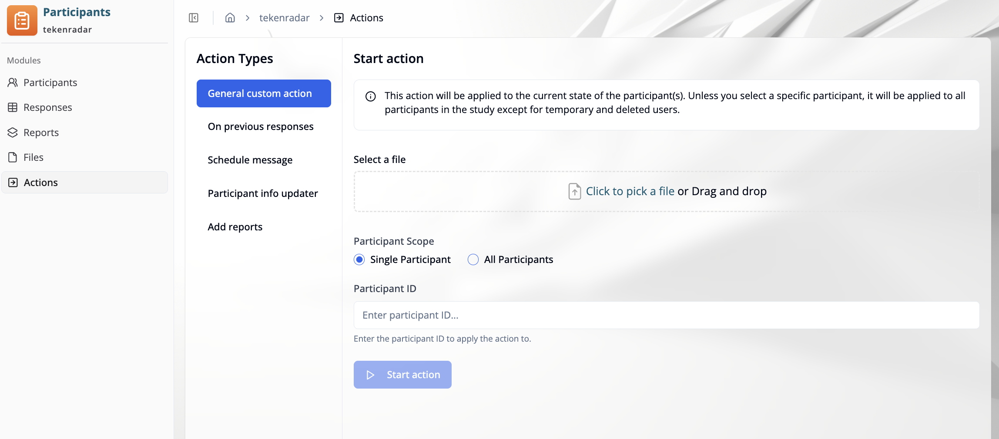
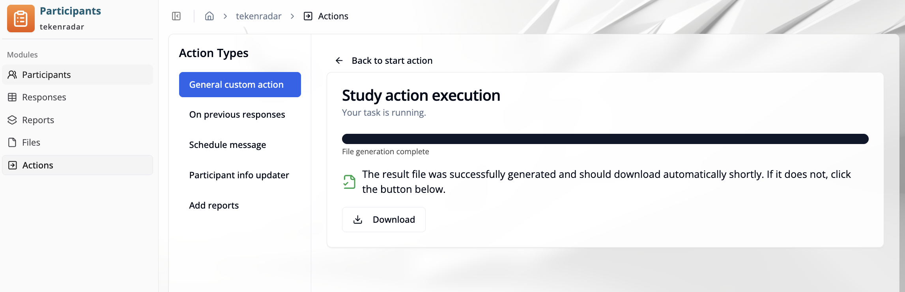
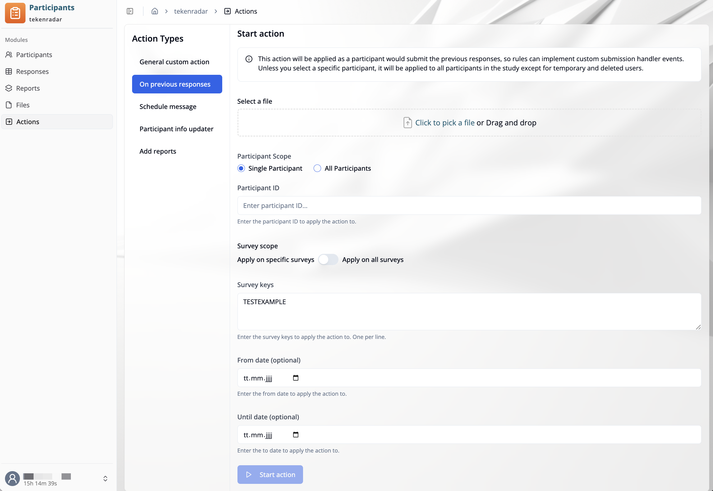
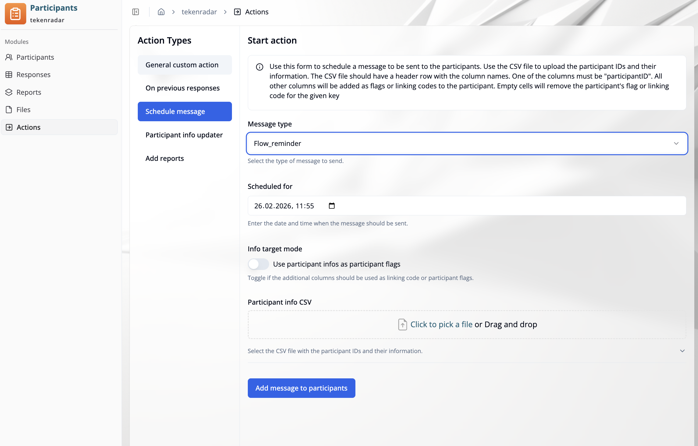
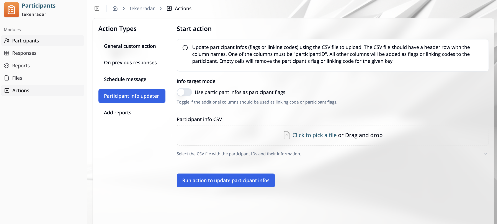
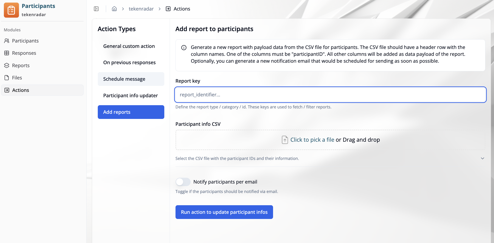

import { Callout } from 'fumadocs-ui/components/callout';

## Overview

The **"Actions"** tab in Participant Management allows you to run study actions on participants. Actions are executed based on a study action file and can be applied to a single participant or all participants in the study.

The available **Action Types** are listed in the left panel:

- **General custom action**
- **On previous responses**
- **Schedule message**
- **Participant info updater**
- **Add reports**

## General Custom Action

A general custom action runs a study action expression against the current participant state. The action is defined in a file and uploaded here.

To create action files, use the [Study Rules Editor](/docs/study-rules-editor/basics/editor-overview).

### Configuration

**Select a file**
Upload the action file by clicking **"Click to pick a file"** or by dragging and dropping it into the upload area.

**Participant Scope**
Choose whether the action should be applied to one participant or all participants:
- **Single Participant**: Enter a specific participant ID in the **"Participant ID"** field below.
- **All Participants**: The action is applied to all active participants in the study. Temporary and deleted participants are excluded.

<Callout type="warn">
When using **All Participants**, the action is applied to every active participant in the study. Review the action file carefully before starting.
</Callout>

Click **"Start action"** to execute.

### Execution

After starting, the **"Study action execution"** view opens and shows the progress of the task.

Once complete, the result file is generated and downloaded automatically. If the download does not start, click the **"Download"** button to retrieve it manually.

## On Previous Responses

This action is applied as if the participant had just submitted their previous responses, allowing rules to implement custom submission handler events.

Unless a specific participant is selected, the action is applied to all participants in the study except temporary and deleted users.

### Configuration

**Select a file**
Upload the action file by clicking **"Click to pick a file"** or by dragging and dropping it into the upload area.

**Participant Scope**
- **Single Participant**: Enter the participant ID in the **"Participant ID"** field.
- **All Participants**: The action is applied to all active participants in the study.

**Survey scope**
Toggle between:
- **Apply on specific surveys**: Enter one survey key per line in the **"Survey keys"** field.
- **Apply on all surveys**: The action is applied across all surveys.

**From date / Until date** (optional)
Restrict the action to responses submitted within a specific date range.

Click **"Start action"** to execute.

## Schedule Message

Use this action type to schedule a message to be sent to participants. A CSV file is used to provide participant IDs and optional additional information.

<Callout type="info">
The CSV file must have a header row. One column must be named `participantID`. All other columns will be added as flags or linking codes to the participant. Empty cells will remove the existing flag or linking code for that key.
</Callout>

### Configuration

**Message type**
Select the type of message to send from the dropdown (e.g., `Flow_reminder`).

**Scheduled for**
Enter the date and time when the message should be sent.

**Info target mode**
Toggle **"Use participant infos as participant flags"** to control whether additional CSV columns are treated as participant flags or linking codes.

**Participant info CSV**
Upload the CSV file containing participant IDs and their information by clicking **"Click to pick a file"** or by dragging and dropping it.

Example CSV structure:

| **participantID** | **group** | **reminder_sent** |
| :---------------- | :-------- | :---------------- |
| abc123            | A         | true              |
| def456            | B         |                   |

In this example, `group` and `reminder_sent` are added as flags or linking codes. An empty cell removes the existing value for that key.

Click **"Add message to participants"** to schedule the message.

## Participant Info Updater

Use this action type to update participant flags or linking codes in bulk using a CSV file.

<Callout type="info">
The CSV file must have a header row. One column must be named `participantID`. All other columns will be added as flags or linking codes to the participant. Empty cells will remove the existing flag or linking code for that key.
</Callout>

### Configuration

**Info target mode**
Toggle **"Use participant infos as participant flags"** to control whether additional CSV columns are treated as participant flags or as linking codes.

**Participant info CSV**
Upload the CSV file containing participant IDs and their information by clicking **"Click to pick a file"** or by dragging and dropping it.

Example CSV structure:

| **participantID** | **testkit_sent** | **group** |
| :---------------- | :--------------- | :-------- |
| abc123            | true             | A         |
| def456            |                  | B         |
| ghi789            | true             |           |

In this example, `testkit_sent` and `group` are added as flags or linking codes. An empty cell (e.g., `def456` has no value for `testkit_sent`) removes the existing value for that key.

Click **"Run action to update participant infos"** to execute.

## Add Reports

Use this action type to generate new reports with payload data from a CSV file for participants. Optionally, a notification email can be scheduled for sending as soon as possible.

<Callout type="info">
The CSV file must have a header row. One column must be named `participantID`. All other columns will be added as data payload of the report.
</Callout>

### Configuration

**Report key**
Enter a key to identify the type or category of the report (e.g., `report_identifier`). These keys are used to fetch and filter reports.

**Participant info CSV**
Upload the CSV file containing participant IDs and their payload data by clicking **"Click to pick a file"** or by dragging and dropping it.

Example CSV structure:

| **participantID** | **studyID** | **score** |
| :---------------- | :---------- | :-------- |
| abc123            | 028         | 42        |
| def456            | 028         | 17        |

In this example, `studyID` and `score` are included as data payload fields in the generated report.

**Notify participants per email**
Toggle this option if participants should be notified via email after the report is added.

Click **"Run action to update participant infos"** to execute.
