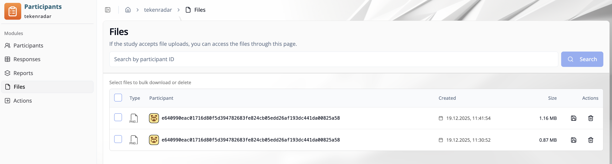

import { Steps, Step } from 'fumadocs-ui/components/steps';
import { Callout } from 'fumadocs-ui/components/callout';

## Overview

The **"Files"** tab in Participant Management shows uploaded participant files for the selected study.
You can search files by participant ID, review file metadata, download individual files, and perform bulk actions.

## Search

Use the search field at the top of the page to find files by **participant ID**.

<Steps>
<Step>
Enter a participant ID in the search input.
</Step>

<Step>
Click **"Search"**.
</Step>

<Step>
The table updates to show matching files.
</Step>
</Steps>

## Files Table

The table contains one row per uploaded file.

- **Type**: File type (for example, PNG)
- **Participant**: Participant ID the file belongs to
- **Created**: Upload date and time
- **Size**: File size
- **Actions**: Row actions for file handling

## Actions

<Steps>
<Step>
**Download a file**: Click the **download** icon in the row to save that file.
</Step>

<Step>
**Delete a file**: Click the **delete** icon in the row to remove that file.
</Step>
</Steps>

## Bulk Selection and Bulk Actions

Use the checkboxes in the first column to select multiple files.

- Select one or more rows for bulk operations.
- Use the available bulk actions to download or delete all selected files.

<Callout type="warn">
Review the selected rows before deleting files. Deletion is permanent and cannot be undone.
</Callout>
