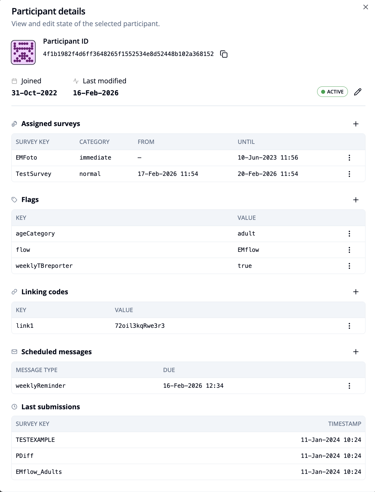
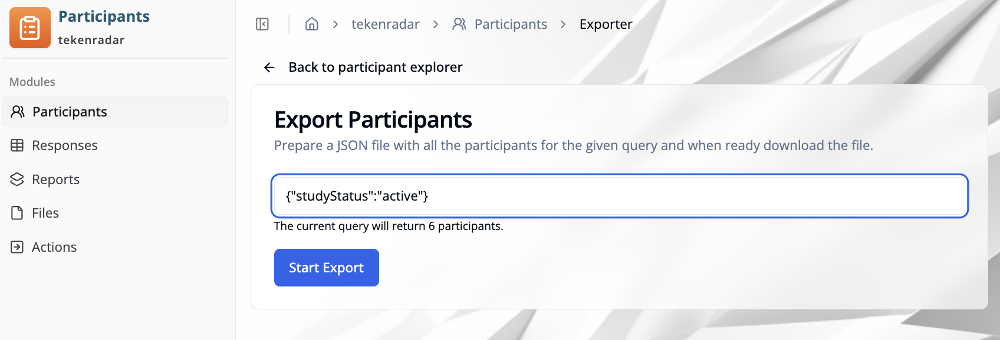

import { Steps, Step } from 'fumadocs-ui/components/steps';
import { ImageZoom } from 'fumadocs-ui/components/image-zoom';
import { Callout } from 'fumadocs-ui/components/callout';
import addAssignmentParticipantImg from './images/participants-add-assignment.png';

## Overview

The **"Participant Management"** module allows you to view, filter, and manage all participant data across your studies. The **"Participants"** tab provides a comprehensive view of all participant accounts in your study. You can filter, sort, and export participant data, as well as access detailed information about each participant.

## Accessing the Participants List

<Steps>
<Step>
Navigate to the **"Participant Management"** module
</Step>

<Step>
Choose a study from the list of available studies (e.g., "tekenradar")
</Step>

<Step>
Select the **"Participants"** tab from the sidebar
</Step>

<Step>
The participants overview for the selected study will be displayed
</Step>
</Steps>

## Participants Table

The participants table displays the following information for each participant:

### Participant ID
- **Icon**: A unique avatar icon for visual identification
- **ID**: The participant's unique identifier (e.g., `486ad22e146ebbff462c3bb...`)
- **Copy button**: Click the copy icon to copy the participant ID to your clipboard

### Joined
The date when the participant first joined the study (e.g., `19-Dec-2023`)

### Last modified
The date when the participant's data was last updated, typically when they submitted a survey. Hover over the info icon for additional details.

### Status
Indicates the current state of the participant account:

● **ACTIVE**: Participant is actively enrolled in the study

● **DELETED**: Participant account has been removed

● **TEMPORARY**: Temporary or virtual participant account (e.g., created before full registration)

● **VIRTUAL**: Virtual participant account

● **OTHER**: Other account status

### Surveys
Shows the number of surveys assigned to the participant. Hover over the info icon for details.

### Flags & codes
Displays participant flags and assigned codes in the format `X + Y`:
- First number: Number of flags assigned to the participant
- Second number: Number of codes assigned to the participant
- Hover over the info icon to view specific flags and codes

### Messages
The number of messages sent to or scheduled for the participant. Hover over the info icon for message details.

## Filtering and Sorting

### Filter
Click the **"Filter"** button at the top of the table to open the filter dialog. The filter dialog provides two options:

#### Simple Filter
Use predefined filter types to quickly filter participants:
- **Study Status**: Filter by participant account status (Active, Deleted, Temporary)
- **Participant ID**: Search for specific participant IDs
- **Participant Flags**: Filter by assigned participant flags
- **Linking Codes**: Filter by linking codes assigned to participants
- **Survey Key**: Filter by specific survey keys
- **Joined**: Filter by participant join date
- **Last Submission**: Filter by date of last survey submission

<Callout type="info">
Only one filter can be applied at a time. To combine multiple filters, use the **Custom JSON** tab.
</Callout>

After selecting a filter type and configuring the criteria, click **"Apply"** to filter the table. Use **"Clear Filter"** to remove the filter, or **"Cancel"** to close the dialog without applying changes.

#### Custom JSON
For advanced filtering, switch to the **"Custom JSON"** tab to write custom filter queries in JSON format. This allows for more complex filtering logic and combination of multiple filter criteria.

### Sort
Click the sort icon (arrows with 0 and 1) next to the filter button to sort the table. The sorting applies to the most recent joined entry and can be toggled between:
- **Ascending**: Oldest joined entries first
- **Descending**: Newest joined entries first

## Pagination

Use the pagination controls at the bottom of the table to navigate through pages.

## Participant Details

Click on any participant row in the table to open the **"Participant details"** panel. This panel displays comprehensive information about the selected participant:

### Participant ID
- The participant's unique identifier with avatar icon
- Click the copy icon to copy the ID to your clipboard

### Joined and Last modified
- **Joined**: Date when the participant joined the study
- **Last modified**: Date of the participant's last activity
- **Status**: Current account status (Active, Deleted, Temporary, etc.)

#### Editing participant status
Click the pencil icon next to the status to change the participant's account status.

### Assigned surveys
View all surveys currently assigned to the participant:
- **Survey Key**: Identifier of the assigned survey
- **Category**: Survey category (e.g., immediate)
- **From**: Start date for survey availability
- **Until**: End date for survey availability

#### Assigning a new survey
To assign a survey to the participant:

<Steps>
<Step>
Click the `+` button in the **"Assigned surveys"** section
</Step>

<Step>
The **"Add assignment"** dialog will open

<ImageZoom
className='p-2 bg-neutral-200 rounded-xl'
src={addAssignmentParticipantImg}
width={400}
height={200}
alt="Add survey assignment"
/>
</Step>

<Step>
Configure the survey assignment:
- **Survey key**: Select the survey from the dropdown (required)
- **Category**: Choose the survey category (e.g., normal, immediate)
- **From**: Set the start date and time for survey availability (optional)
- **Until**: Set the end date and time for survey availability (optional)
</Step>

<Step>
Click **"Save"** to assign the survey, or **"Cancel"** to close without saving
</Step>
</Steps>

#### Editing or removing surveys
Click the **three-dots** menu icon next to a survey to:
- **Edit**: Modify the survey's parameters (category, from/until dates)
- **Move up/Move down**: Change the order of surveys in the list
- **Remove**: Delete the survey assignment

### Flags
View and manage participant flags (key-value pairs):
- **Key**: Flag identifier (e.g., ageCategory, flow, weeklyTBreporter)
- **Value**: Flag value (e.g., adult, EMflow, true)

#### Managing flags
- **Add flag**: Click the `+` button to create a new flag
- **Edit flag**: Click the **three-dots** menu icon next to a flag to modify its key or value
- **Delete flag**: Click the **three-dots** menu icon and select delete to remove a flag

### Linking codes
View and manage linking codes (key-value pairs):
- **Key**: Linking code identifier 
- **Value**: Linking code value 

#### Managing linking codes
- **Add linking code**: Click the `+` button to create a new linking code
- **Edit linking code**: Click the **three-dots** menu icon next to a linking code to modify its value
- **Delete linking code**: Click the **three-dots** menu icon and select delete to remove a linking code

### Scheduled messages
View all scheduled messages for the participant:
- **Message Type**: Type of the scheduled message 
- **Due**: Date and time when the message is scheduled to be sent

#### Managing scheduled messages
- **Add message**: Click the `+` button to schedule a new message. In the dialog, specify:
  - **Message type**: Select the type of message to send
  - **Scheduled for**: Set the date and time when the message should be sent
- **Edit message**: Click the **three-dots** menu icon next to a message to modify its parameters
- **Delete message**: Click the **three-dots** menu icon and select delete to remove a scheduled message

### Last submissions
View the participant's recent survey submissions:
- **Survey Key**: Identifier of the submitted survey
- **Timestamp**: Date and time of submission

Close the panel by clicking the **X** button in the top-right corner.

## Exporting Participant Data

Click the `Open Exporter` button in the top-right corner to export participant data. This opens the **"Export Participants"** page where you can prepare a JSON file with all participants matching your query.

### Using the Exporter

The exporter page shows:
- **Search field**: Enter filter criteria in JSON format to specify which participants to export (e.g.: `{"studyStatus":"active"}`)
- **Current query preview**: Displays how many participants match your query before you start the export.
- `Start Export` button: Click to begin the export process. The exported data will be downloaded as a JSON file.
