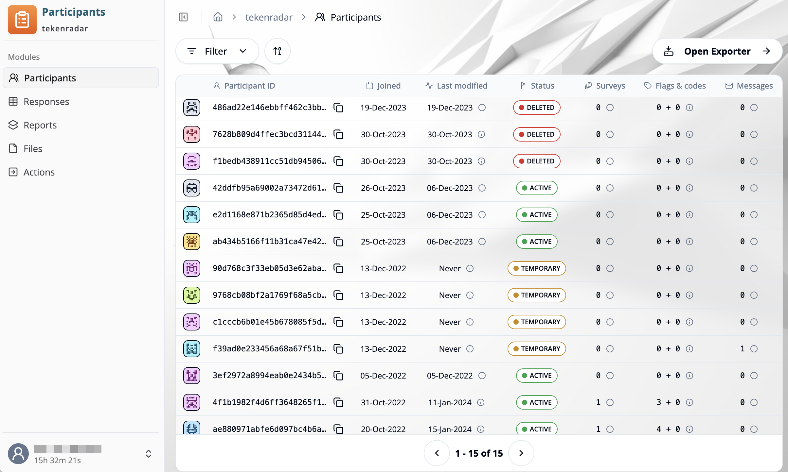

## Overview

The **"Participant Management"** module allows you to view, filter, and manage all participant data across your studies. The **"Participants"** tab provides a comprehensive view of all participant accounts in your study. You can filter, sort, and export participant data, as well as access detailed information about each participant.

## Accessing the Participants List

1. Navigate to the **"Participant Management"** module
2. Choose a study from the list of available studies (e.g., "tekenradar")
3. Select the **"Participants"** tab from the sidebar
4. The participants overview for the selected study will be displayed

## Participants Table

The participants table displays the following information for each participant:

### Participant ID
- **Icon**: A unique avatar icon for visual identification
- **ID**: The participant's unique identifier (e.g., `486ad22e146ebbff462c3bb...`)
- **Copy button**: Click the copy icon to copy the participant ID to your clipboard

### Joined
The date when the participant first joined the study (e.g., `19-Dec-2023`)

### Last modified
The date when the participant's data was last updated, typically when they submitted a survey. Click the info icon for additional details.

### Status
Indicates the current state of the participant account:
- ACTIVE: Participant is actively enrolled in the study
- DELETED: Participant account has been removed
- TEMPORARY: Temporary or virtual participant account (e.g., created before full registration)

### Surveys
Shows the number of surveys assigned to or completed by the participant. Click the info icon for details.

### Flags & codes
Displays participant flags and assigned codes in the format `X + Y`:
- First number: Number of flags assigned to the participant
- Second number: Number of codes assigned to the participant
- Click the info icon to view specific flags and codes

### Messages
The number of messages sent to or scheduled for the participant. Click the info icon for message details.

## Filtering and Sorting

### Filter
Click the **Filter** button at the top of the table to:
- Filter by participant status (Active, Deleted, Temporary)
- Filter by date range
- Filter by specific flags or codes
- Apply custom search criteria

### Sort
Click the sort icon (arrows) to sort the table by different columns. You can sort by:
- Participant ID
- Join date
- Last modified date
- Status
- Number of surveys, flags, or messages

## Exporting Participant Data

Click the **Open Exporter** button in the top-right corner to export participant data:
1. Select the fields you want to include in the export
2. Choose the export format (CSV, Excel, etc.)
3. Apply any filters before exporting
4. Download the exported file

## Pagination

Use the pagination controls at the bottom of the table to navigate through pages:
- **Arrow buttons**: Navigate to previous/next page
- **Page indicator**: Shows current page and total count (e.g., "1 - 15 of 15")

## Working with Individual Participants

Click on any participant row to access detailed information and perform actions such as:
- Viewing participant details and history
- Managing assigned surveys
- Updating flags and codes
- Sending messages
- Viewing survey responses
