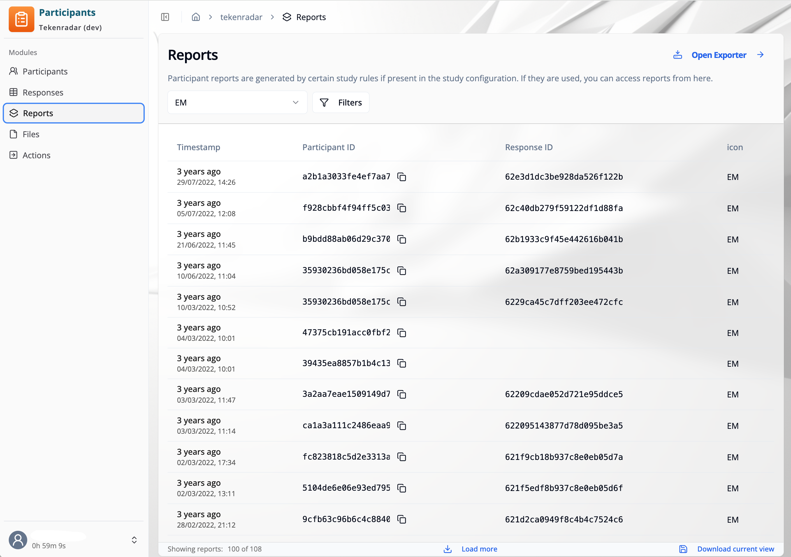
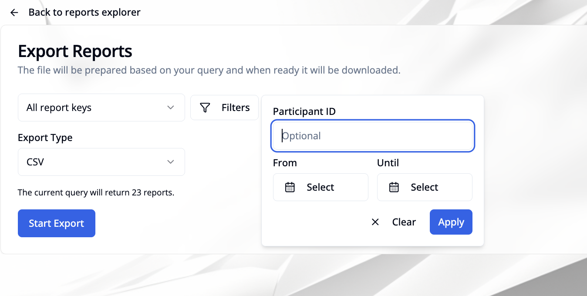

import { TypeTable } from 'fumadocs-ui/components/type-table';
import { ImageZoom } from 'fumadocs-ui/components/image-zoom';
import { Callout } from 'fumadocs-ui/components/callout';
import downloadOptionsImg from './images/download-options.png';
import optionalFiltersImg from './images/optional-filters.png';
import reportKeySelectionImg from './images/report-key-selection.png';

## Introduction

A "report" is a data entry for a participant with the following fields in the database:

<TypeTable
  type={{
    id: {
      description: 'Unique identifier of the report entry in the database',
      type: 'string',
    },
    key: {
      description: 'Report key/name describing the kind of entry - type of the report',
      type: 'string',
      required: true,
    },
    participantID: {
      description: 'Identifier of the participant the report belongs to',
      type: 'string',
      required: true,
    },
    responseID: {
      description: 'Identifier of the originating response or event, if any',
      type: 'string',
    },
    timestamp: {
      description: 'Unix timestamp (s) when the report was created',
      type: 'number',
      required: true,
    },
    modifiedAt: {
      description: 'Date-time format of the last modification of the report',
      type: 'string'
    },
    data: {
      description: 'Optional list of key/value data points attached to the report',
      type: 'Array<ReportDataItem> (optional)',
    },
  }}
/>

### Report data item

Each entry in `data` has the following structure:

<TypeTable
  type={{
    key: {
      description: 'Name of the data field',
      type: 'string',
    },
    value: {
      description: 'String representation of the value',
      type: 'string',
    },
    dtype: {
      description: 'Optional data type hint of the value for how to parse it',
      type: "'date' | 'float' | 'int' | 'string' | 'rawMessage' | 'keyList' (optional)",
    },
  }}
/>

Example:

```json
{
  "key": "studyID",
  "value": "028"
}
```


### Use cases for reports

- Data projection: when a participant submits a survey response, selected information can be extracted and stored in a report. Multiple reports (with different keys) can be generated from the same response.

- Reference earlier responses for the participant: reports can be used to ask about previously submitted responses while minimizing the exposed information.

- Event logging: participant actions can be stored as reports. For example, clicking a button can create a report entry (e.g., ordering a test kit through the website).


## Accessing reports in the UI

### Simplified table view

To access the reports for a study, go to the **"Participants"** module, select a study if necessary, and click the **"Reports"** option in the left sidebar.
On this page, you can see a paginated list of reports for the study.

<Callout type="info">
In the simplified table view, reports are shown in a flattened format. Data attributes appear as separate table columns, and the `dtype` field is not included.
Use the bulk download in raw format if you need the complete report structure.
</Callout>

<div className='block mx-auto w-fit'>

</div>


#### Filter reports

**Report key selector**: Use the report key selector (top left above the table) to select which reports to show.

<ImageZoom
className='p-2 bg-neutral-200 rounded-xl mx-auto'
src={reportKeySelectionImg}
width={400}
height={200}
alt="Report key selector"
/>

**Additional filters**: Use the additional filters to filter the reports by participant ID or timestamp - available through the button next to the report key selector. These additional filters are added to the report key selector filter, so only reports that match all filters will be shown.

<ImageZoom
className='p-2 bg-neutral-200 rounded-xl mx-auto'
src={optionalFiltersImg}
width={400}
height={200}
alt="Additional filters"
/>


#### Pagination / Load more

The table initially shows 100 reports (starting from the most recent). You can load more reports by clicking the "Load more" button at the bottom of the table (center).

#### Download current view as CSV or JSON

On the bottom right corner of the "Reports" card, use the "Download current view" which offers options to download the current table as CSV or JSON.


<ImageZoom
className='p-2 bg-neutral-200 rounded-xl mx-auto'
src={downloadOptionsImg}
width={240}
height={240}
alt="Download options"
/>


### Bulk download (CSV or Raw)

On the top right corner of the "Reports" card, use the "Open Exporter" button to open the exporter mode.

Use the exporter form to configure your download:

- **Report key**: Select one report key or keep **All report keys**.
- **Export Type**: Choose **CSV** or **Raw**.
- **Filters** (optional): Use the filter panel to narrow results by **Participant ID** and date range (**From** / **Until**).

The UI shows how many reports match the current selection. Click **"Start Export"** to start the export process.

<div className='block mx-auto w-fit'>

</div>


