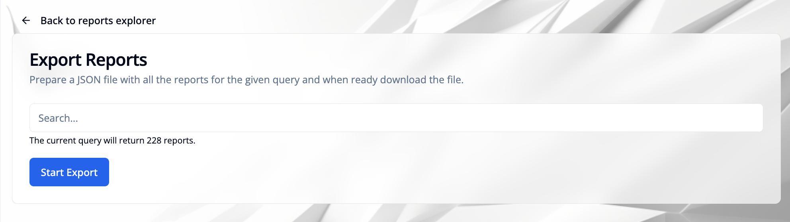

import { TypeTable } from 'fumadocs-ui/components/type-table';

## Introduction

A "report" is a data entry for a participant with the following fields in the database:

<TypeTable
  type={{
    id: {
      description: 'Unique identifier of the report entry in the database',
      type: 'string',
    },
    key: {
      description: 'Report key/name describing the kind of entry - type of the report',
      type: 'string',
      required: true,
    },
    participantID: {
      description: 'Identifier of the participant the report belongs to',
      type: 'string',
      required: true,
    },
    responseID: {
      description: 'Identifier of the originating response or event, if any',
      type: 'string',
    },
    timestamp: {
      description: 'Unix timestamp (s) when the report was created',
      type: 'number',
      required: true,
    },
    data: {
      description: 'Optional list of key/value data points attached to the report',
      type: 'Array<ReportDataItem> (optional)',
    },
  }}
/>

### Report data item

Each entry in `data` has the following structure:

<TypeTable
  type={{
    key: {
      description: 'Name of the data field',
      type: 'string',
    },
    value: {
      description: 'String representation of the value',
      type: 'string',
    },
    dtype: {
      description: 'Optional data type hint of the value for how to parse it',
      type: "'date' | 'float' | 'int' | 'string' | 'rawMessage' | 'keyList' (optional)",
    },
  }}
/>


### Use cases for reports

- Data projection: when the participant submits a response to a survey, we can extract some information from it and store it in a report. It's possible to generate multiple reports (with different keys) from the same response.

- Reference earlier responses for the user: when we want to ask questions about which earlier response the user is referring to, we can use reports to minimize the expose information.

- Event logging: when the participant performs an action, we can store it in a report. For example, when the participant clicks a button, we can store it in a report. (E.g., Order test kit through the website)


## Accessing reports in the UI

### Simplified table view

To access the reports for a study, go to the **"Participants"** module, select a study if necessary, and click the **"Reports"** option in the left sidebar.
On this page, you can see a paginated list of reports for the study.

> Note: Simplified table view: flat report structure -> data attributes are included as columns in the table, without the dtype field. Use the bulk download in raw format to get the full report structure.


#### Filter reports

**Report key selector**: Use the report key selector (top left above the table) to select which reports to show.


**Additional filters**: Use the additional filters to filter the reports by participant ID or timestamp - available through the button next to the report key selector. These additional filters are added to the report key selector filter, so only reports that match all filters will be shown.


#### Pagination / Load more

The table initially shows 100 reports (starting from the most recent). You can load more reports by clicking the "Load more" button at the bottom of the table (center).

#### Download current view as CSV or JSON

On the bottom right corner of the "Reports" card, use the "Download current view" which offers options to download the current table as CSV or JSON.


### Bulk download in raw format

On the top right corner of the "Reports" card, use the "Open Exporter" button to open the exporter mode.

Use the search field to filter the reports by participant ID, report key, or timestamp. The search term should be a MongoDB query in JSON format.
Clicking the "Start Export" button will start the export process.


**Examples:**

```json
{ "participantID": "89f30cc949cfb380994eb609d83d820be0710d0923b03520" }
```

```json
{ "key": "test_kit_ordered", "timestamp": { "$gte": 1725130000, "$lte": 1727818400 } }
```




