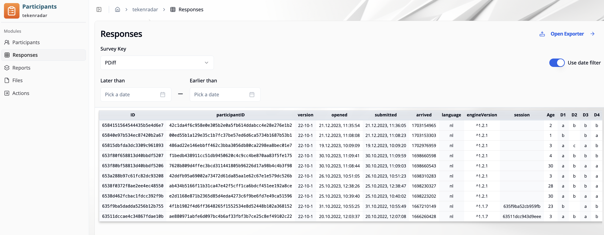
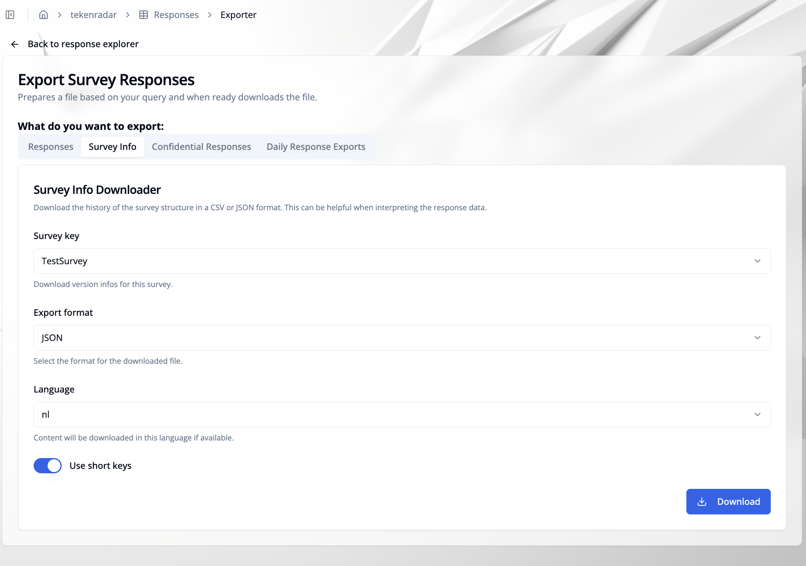
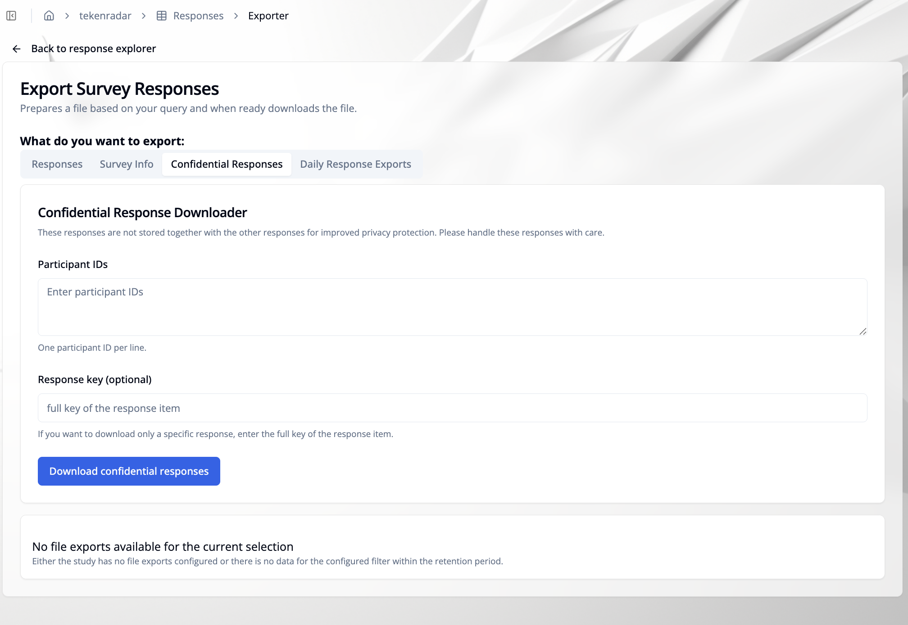

import { Steps, Step } from 'fumadocs-ui/components/steps';

## Overview

The **"Responses"** tab in the Participant Management module allows you to view and analyze all survey responses submitted by participants. You can filter responses by survey key and date range, and export the data for further analysis.

## Filtering Responses

### Survey Key
Select a survey from the **"Survey Key"** dropdown to view responses for that specific survey (e.g., PDiff, EMfoto).

### Date Filter
Use the date filter toggle to filter responses by submission date:

1. Enable the **"Use date filter"** toggle in the top-right corner
2. Set the date range:
   - **Later than**: Select the start date to show responses submitted after this date
   - **Earlier than**: Select the end date to show responses submitted before this date
3. The table will automatically update to show only responses within the selected date range

## Responses Table

The responses table displays detailed information for each survey submission:

- **ID**: Unique identifier for the response
- **participantID**: ID of the participant who submitted the response
- **version**: Survey version number (e.g., 22-10-1)
- **opened**: Date and time when the survey was opened by the participant
- **submitted**: Date and time when the survey was submitted
- **arrived**: Timestamp when the response was received by the system
- **language**: Language in which the survey was completed (e.g., nl)
- **engineVersion**: Version of the survey engine used (e.g., ^1.2.1)
- **session**: Session identifier
- **Age**: Age value from the response
- **D1, D2, D3, D4...**: Individual survey question responses (column names depend on the questions included in the survey and their formats)

The table shows all response data including meta information based on the selected survey.

## Response Formats by Question Type

The format of responses in the table varies depending on the question type used in the survey:

### Single Choice and Dropdown
**Columns**: 1 column per question (additional columns if options have input fields)  
**Column name**: Question key (e.g., `SCG1`)  
**Format**: The key of the selected answer option (e.g., `o1`, `o2`, `o3`)

**Additional input fields**: If an answer option includes a text or number input field, an additional column is created with the name: Question key + `-` + option key (e.g., `SCG1-o1`, `SCG1-o2`). The format follows the input type (text string or number).

### Multiple Choice
**Columns**: Multiple columns - one for each answer option (additional columns if options have input fields)  
**Column name**: Question key + `-` + option index (e.g., `MCG1-0`, `MCG1-1`, `MCG1-2`)  
**Format**: `TRUE` for selected options, `FALSE` for unselected options

**Additional input fields**: If an answer option includes a text or number input field, an additional column is created with the name: Question key + `-` + option key + `-open` (e.g., `MCG1-0-open`, `MCG1-1-open`). The format follows the input type (text string or number).

### Text Input
**Columns**: 1 column per question  
**Column name**: Question key (e.g., `TextInput1`)  
**Format**: The entered text as a string (e.g., `I am a text response`)

### Date Input
**Columns**: 1 column per question  
**Column name**: Question key (e.g., `DateInput`)  
**Format**: Date as timestamp (e.g., `1673478000`)

### Number Input
**Columns**: 1 column per question  
**Column name**: Question key (e.g., `Age`, `NumberInput`)  
**Format**: The entered number value (e.g., `25`, `3.14`)

### Slider
**Columns**: 1 column per question  
**Column name**: Question key (e.g., `Slider1`, `Rating`)  
**Format**: The selected number from the slider range

### Single Choice and Bipolar Likert Array
**Columns**: One column per row of the array 
**Column name**: Question key + "-" + row key (e.g., `LIKERT-row1`, `LIKERT-row2`)  
**Format**: The column key of the selected answer option for each row (e.g., `col1`, `col2`, `col3`)

### Matrix Questions
**Columns**: One column for each combination of row and column  
**Column name**: Question key + "-" + row key + "-" + column key (e.g., `RMa-r1-c1`, `RMa-r1-c2`, `RMa-r2-c1`)  
**Format**: The entry of that cell depending on the input type (e.g., `3.14`, `I am a text response`, `TRUE`)

### Cloze Questions
**Columns**: Variable, depending on input types within the cloze question  
**Column name**: Depends on the structure of the cloze question:
- For **multiple choice cloze**: Multiple columns following the same rules as regular multiple choice questions - one column per option with Question key + `-` + option index (e.g., `SCGCloze1-0`, `SCGCloze1-1`), plus additional columns for input fields within options: Question key + `-` + input identifier (e.g., `SCGCloze1-cloze1.textinput1`)
- For **text-based cloze**: Question key + `-` + input identifier for each blank/input field (e.g., `CLZ-text`, `TextCloze-input1`)

**Format**: Follows the format rules above based on the input type for each element:
- Multiple choice selections: `TRUE` for selected options, `FALSE` for unselected options
- Text inputs: Text string
- Number inputs: Number value
- Other input types: According to their respective format rules

### Custom Questions
**Columns**: Variable, depending on the custom question design  
**Format**: Follows the format rules above based on the input types used in the custom question

## Exporting Response Data

Click the **"Open Exporter"** button in the top-right corner to export response data. This opens the **"Export Survey Responses"** page.

### Export Options

The exporter provides multiple tabs for different export types:
- **Responses**: Export survey response data
- **Survey Info**: Export survey metadata and structure
- **Confidential Responses**: Export responses with confidential information
- **Daily Response Exports**: Export responses grouped by day

### Response Downloader

Configure the following options to export survey responses:

#### Survey key
Select the survey you want to export responses for from the dropdown menu (e.g., TESTEXAMPLE).

#### Date Range
- **From**: Set the start date - responses from this date onwards will be included
- **Until**: Set the end date - responses up to this date will be included

#### Export format
Choose from the following export formats:
- **CSV (wide)**: Export as CSV file with each response as a row and all questions as columns (wide format)
- **CSV (long)**: Export as CSV file in long format with question-response pairs
- **JSON**: Export as JSON file

#### Key separator
Define a separator character used between item key, slot key, and optional suffix in exported column names (e.g., `-` produces column names like `Q1-0`, `Q1-1`).

#### Use short keys
Toggle this option to remove the survey name prefix from response column headers (e.g., `mcg-o1` instead of `TESTEXAMPLE.mcg-o1`).

### Survey Info Downloader

Use this tab to export survey structure and version history for a selected survey.

Configure the following options:

#### Survey key
Select the survey for which you want to download survey version information.

#### Export format
Choose the file format:
- **CSV**: Tabular export of survey structure/version information
- **JSON**: Structured export for programmatic processing

#### Language
Select the language for the exported content (if available).
You can also choose **without labels** to export keys without translated labels.

#### Use short keys
Toggle this option to remove the survey name prefix from keys in the export (e.g., `mcg-o1` instead of `TESTEXAMPLE.mcg-o1`).

Click **"Download"** to start the export.

### Confidential Response Downloader

Use this tab to export confidential responses, which are stored separately from regular responses.

Configure the following options:

#### Participant IDs
Enter one participant ID per line for all participants whose confidential responses should be included.

#### Response key (optional)
If you only want a specific response, enter the full response item key.

Click **"Download confidential responses"** to start the export.

### Daily Response Exports

Use this tab to view and download already generated daily export files.

You can filter the list by:
- **Survey key** (e.g., all survey keys or a specific survey)
- **Format** (e.g., CSV or JSON)
- **Date** (e.g., all dates or a specific day)

### Starting the Export

Once all options are configured, click **"Start export task"** to generate and download the export file.
