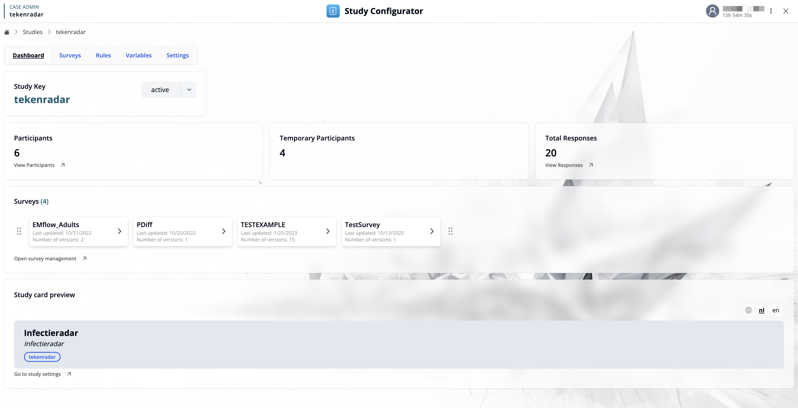
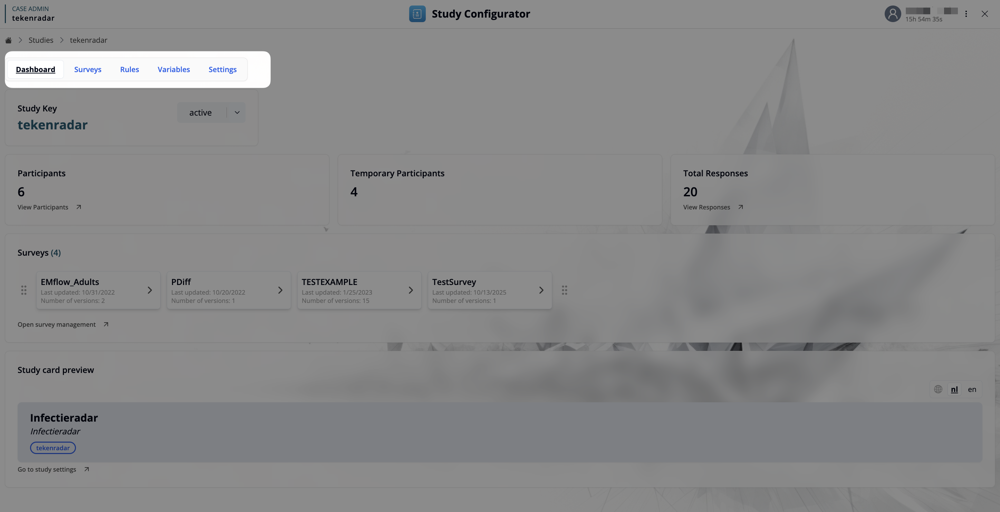
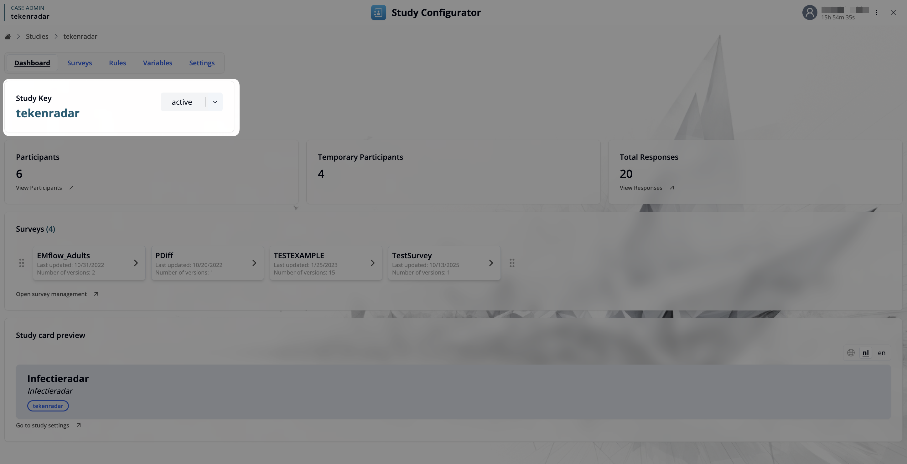
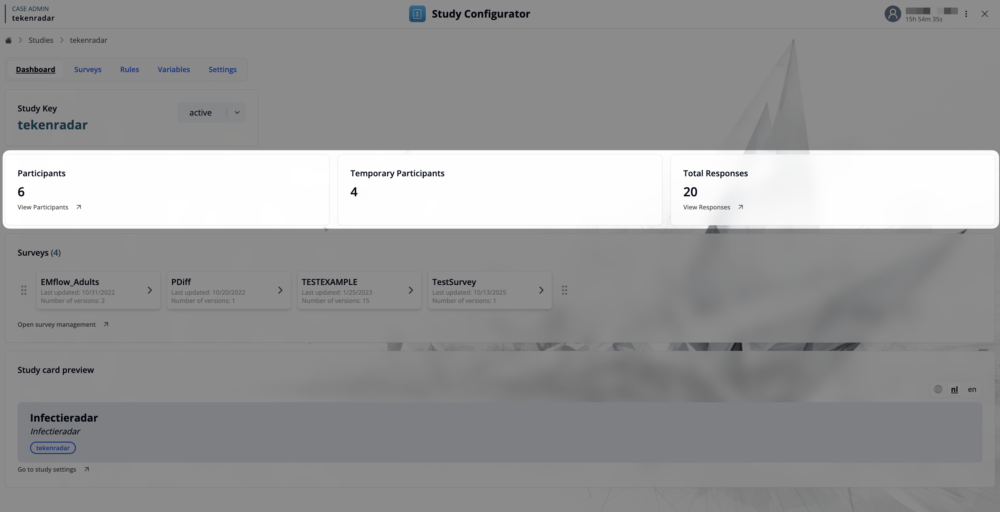
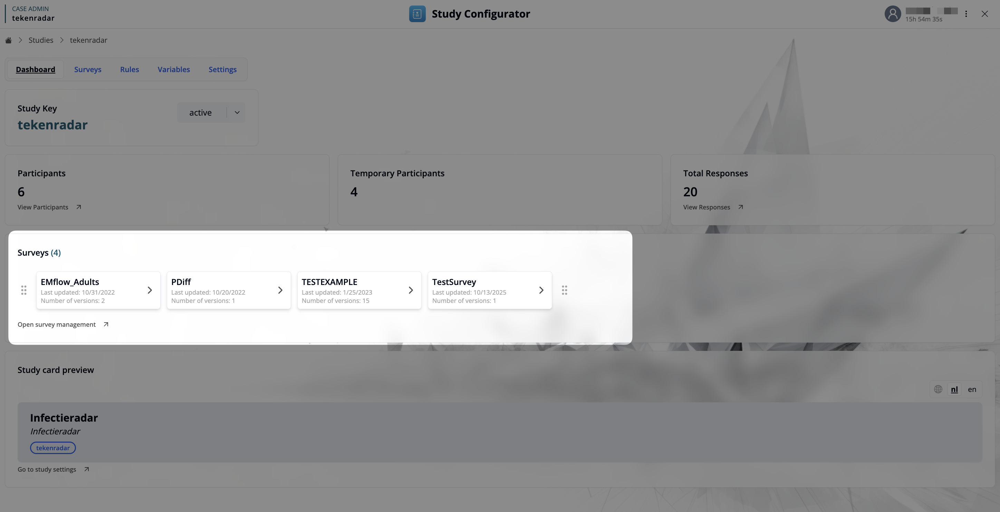
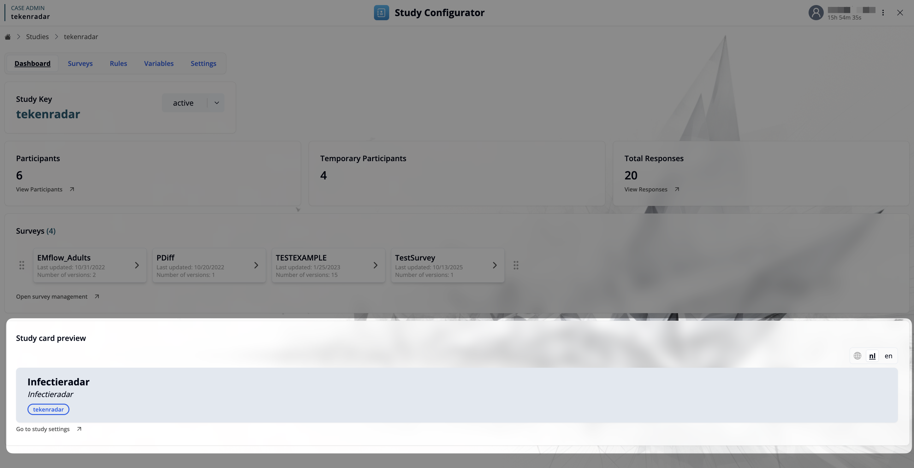
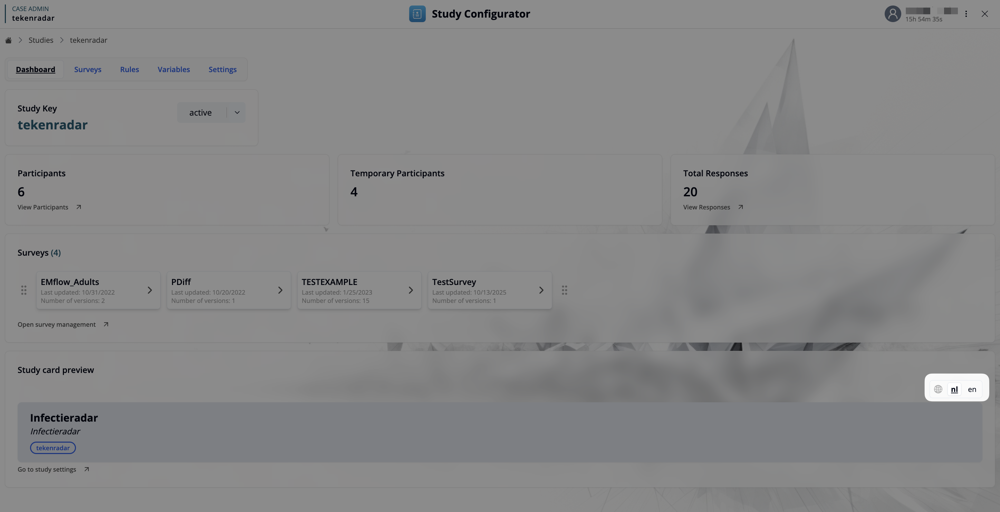

## Study Configurator Dashboard

The Study Configurator lets you manage study-wide configuration: surveys, rules, variables, and settings. The dashboard provides a quick summary and entry points to all relevant actions.

### Top Navigation Bar
- **[Dashboard]**: Returns to the main overview of the study.
- **[Surveys](/docs/study-configurator/surveys)**: Manage surveys for the current study.
- **[Rules](/docs/study-configurator/rules)**: View published rules versions and upload a new version.
- **[Variables](/docs/study-configurator/study-variables)**: Define and manage key–value pairs used across rules and surveys.
- **[Settings](/docs/study-configurator/settings)**: Configure settings like status, code lists, notifications, and access.

### Study Header
- **Study Key**: Displays the unique study key (e.g., `tekenradar`). 
- **Status Toggle**: Shows current status (e.g., `active`). Use the dropdown to update the study status when needed.

### Overview Cards
- **Participants**: Shows the number of registered participants. Use “View Participants” to open participant management.
- **Temporary Participants**: Shows the number of temporary participants (e.g., pre-registration).
- **Total Responses**: Shows the total number of submitted survey responses. Use “View Responses” to open the responses explorer.

### Surveys
- Displays all surveys in the study, including last updated date and number of versions.
- Click a survey card to open survey management for that survey.
- The link **Open survey management** takes you directly to the central surveys management page.

### Study Card Preview
- Shows how the study card is presented in management views.
- Includes the name, description and tags of the study and a link to go to study settings.

### Language Toggle
- Switch interface labels between supported languages (e.g., `nl`, `en`). 

