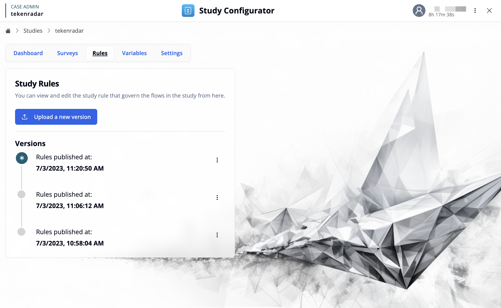

[← Back to Study Configurator Overview](/docs/study-configurator/configurator-overview)

## Overview

The Rules workspace provides an interface for managing study rules that govern the flows and behaviors in your study. Study rules define scheduling, triggers, and event handlers that control when and how participants interact with surveys and other study elements.

To create and edit study rules, use the [Study Rules Editor](/docs/study-rules-editor/basics/editor-overview).

## Key Features

### Upload Study Rules

Use the **"Upload a new version"** button to import a study rules definition file (JSON format). This allows you to:
- Deploy new rule configurations to your study
- Update existing rules with modified logic
- Import rules created with the [Study Rules Editor](/docs/study-rules-editor/basics/editor-overview)

### Version Management

The Versions section displays a chronological history of all published rule versions, with each entry showing:

- **Publication Status**: The currently active version appears with a star icon
- **Timestamp**: The exact date and time when the rules were published (e.g., 7/3/2023, 11:20:50 AM)

#### Version Actions

Each version has an options menu (three-dot icon) with the following actions:

- **Download JSON**: Export the rules version as a JSON file for backup, review, or editing
- **Delete version**: Permanently remove this version from the history (cannot be undone)

<Callout type="info">
Only one rules version can be active at a time. Uploading a new version automatically makes it the active version and unpublishes the previous one.
</Callout>
