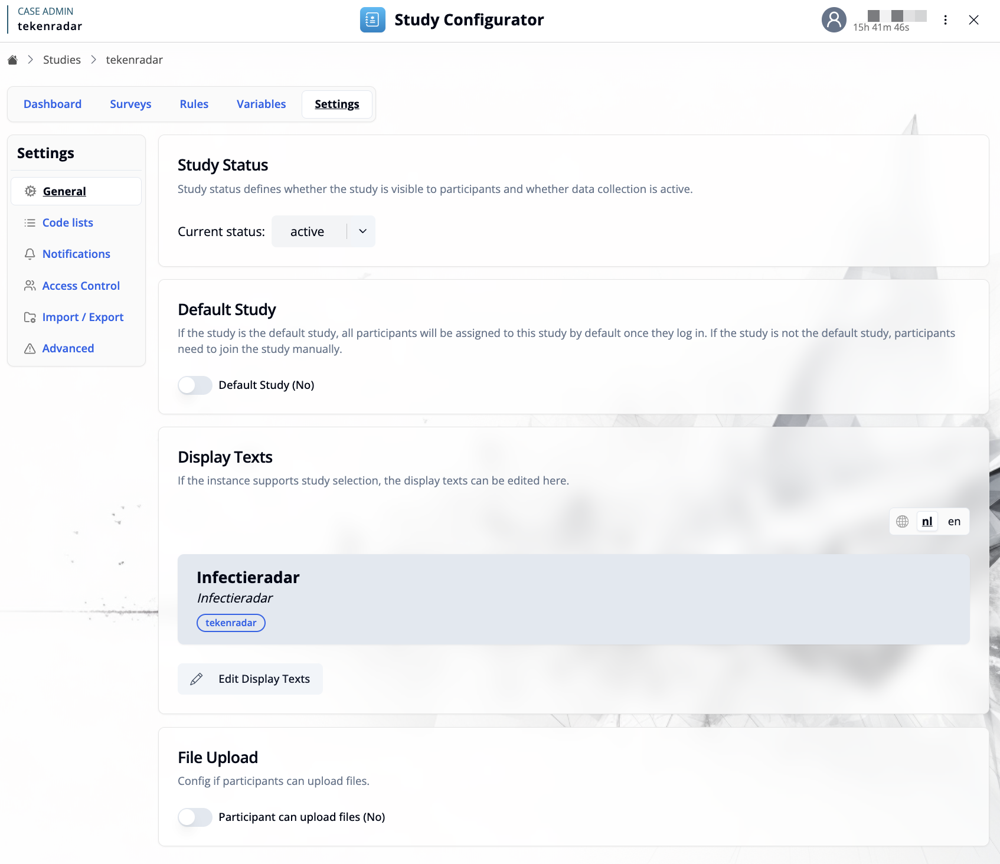
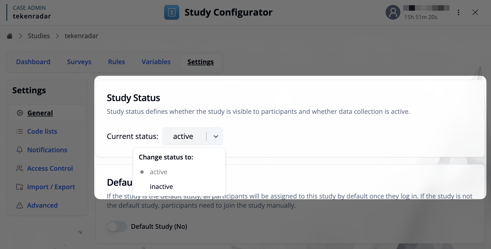
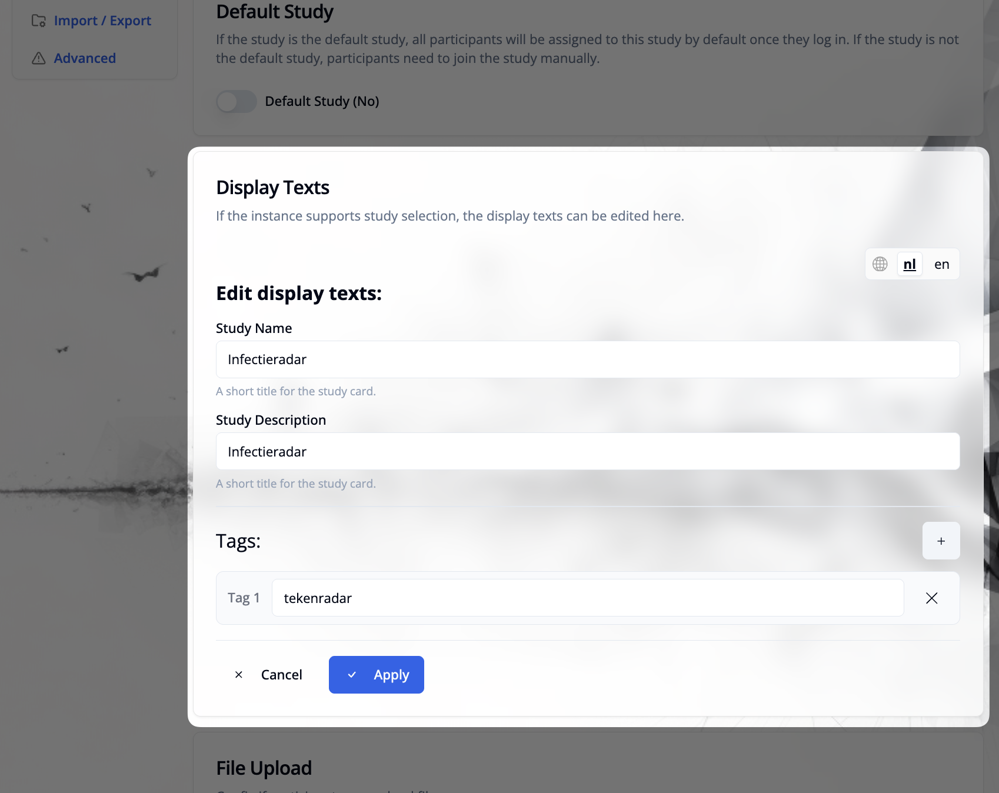
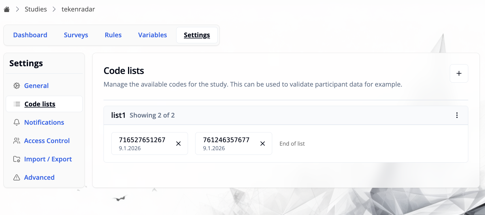
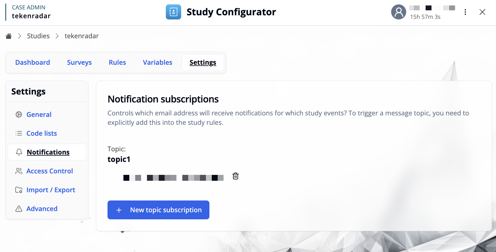
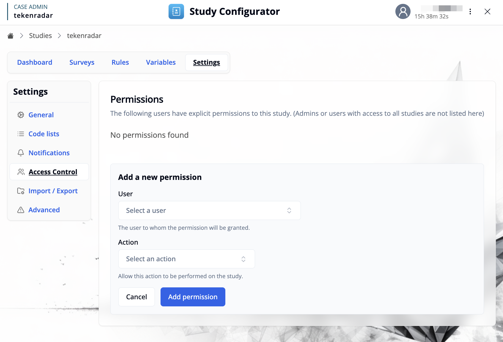
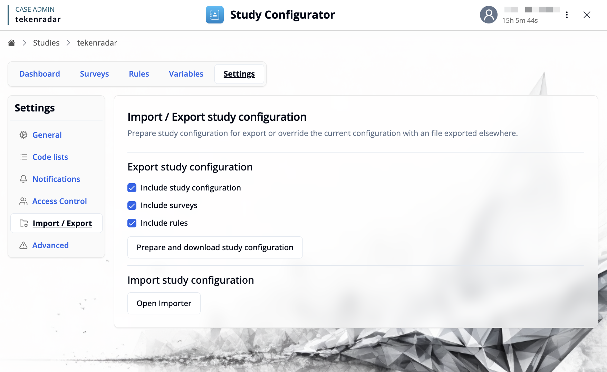
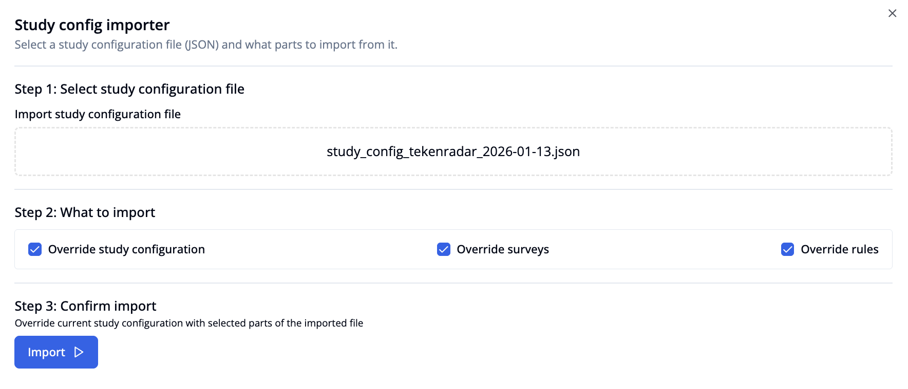
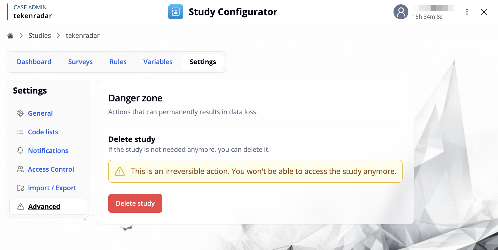

import { ImageZoom } from 'fumadocs-ui/components/image-zoom';
import { Step, Steps } from 'fumadocs-ui/components/steps';
import codeListsAddEntriesImg from './images/code-lists2.png';
import notificationsNewTopicImg from './images/notifications2.png';

[← Back to Study Configurator Overview](/docs/study-configurator/configurator-overview)

## Overview

The Settings workspace provides access to various configuration options for your study. Settings are organized into different categories accessible through the left sidebar.

## General

The General tab contains the core configuration settings for your study.

### Study Status

Study status defines whether the study is visible to participants and whether data collection is active.

- **Current status**: Select from the dropdown to set the study status:
  - `active`: Study is visible and collecting data
  - `inactive`: Study is not visible to participants

### Default Study

Configure whether this study should be the default study for your instance.

- **Default Study**: When enabled, all participants will be automatically assigned to this study by default once they log in. If the study is not the default study, participants need to join the study manually.

### Display Texts

If the instance supports study selection, the display texts define how the study appears to participants when they choose which study to join.

Click **"Edit Display Texts"** to open the editor where you can configure:

- **Study Name**: A short title for the study card (e.g., "Infectieradar")
- **Study Description**: A brief description of the study shown on the study card
- **Tags**: Optional tags to categorize the study (e.g., "tekenradar")
- **Language Support**: Edit texts for each supported language using the language selector in the top right

Changes are applied by clicking the **"Apply"** button.

### File Upload

Toggle this option to configure whether participants are allowed to upload files as part of their study participation.

## Code Lists

The Code lists tab allows you to manage available codes for the study. These can be used to validate participant data, for example when participants need to enter specific codes to join the study or access certain features.

### Managing Code Lists

Each code list displays:
- **List name**: The identifier for the code list (e.g., "list1")
- **Code entries**: Shows the codes with their creation date (e.g., "9.1.2026")
- **Entry count**: Indicates how many codes are shown (e.g., "Showing 2 of 2")
- **Delete option**: Each code has an X button to remove it from the list

### Adding Codes

Click the **+** button in the top right to add new codes to a list.

In the "Add Code List Entries" dialog:

<Steps>
<Step>
**Select code list**: Choose an existing list from the dropdown or create a new one by entering a new name.

<ImageZoom
className='p-2 bg-neutral-200 rounded-xl'
src={codeListsAddEntriesImg}
width={400}
height={200}
alt="Add Code List Entries" 
/>

</Step><Step>
**Enter codes**: Add codes in the text area, one per line
</Step><Step>
**Upload**: Click "Upload codes" to add the codes to the selected list
</Step>
</Steps>

## Notifications

The Notifications tab allows you to configure email notification subscriptions for study events. This controls which email addresses will receive notifications when specific study events occur.

<Callout type="info">
To trigger a message topic, you need to use the ["Notify researchers (Email)"](/docs/study-rules-editor/basics/study-rules#notify-researchers-email) action in the Study Rules Editor when defining event handlers.
</Callout>

### Managing Notification Subscriptions

Each notification topic shows:
- **Topic name**: The identifier for the notification topic (e.g., "topic1"). This is identical to the **message type** attribute used in email templates.
- **Subscribed emails**: Email addresses that will receive notifications for this topic, displayed as icons
- **Delete option**: Remove email addresses from the subscription

### Adding a New Topic Subscription

Click **"+ New topic subscription"** to create a new notification subscription.

<ImageZoom
className='p-2 bg-neutral-200 rounded-xl'
src={notificationsNewTopicImg}
width={400}
height={200}
alt="New Topic Subscription" 
/>

In the "New topic subscription" dialog:

1. **Message type**: Enter the type of notification (e.g., "reminder"). Use `*` to subscribe to all message types.
2. **Email**: Enter the email address that should receive notifications for this topic
3. **Add**: Click the "Add" button to create the subscription

The email address will then receive notifications whenever this topic is triggered through the study rules.

<Callout type="info">
To subscribe multiple email addresses to the same topic, repeat this process for each email address individually.
</Callout>

## Access Control

The Access Control tab allows you to manage user permissions for this study. Here you can grant specific users explicit permissions to perform certain actions on the study.

<Callout type="info">
Admins or users with access to all studies are not listed here, as they already have full access.
</Callout>

### Managing Permissions

The permissions list shows all users who have been granted explicit permissions to this study. If no permissions have been configured, you'll see "No permissions found".

### Adding a New Permission

Click **"+ Add a new permission"** to grant a user access to the study.

In the "Add a new permission" form:

1. **User**: Select the user from the dropdown to whom the permission will be granted
2. **Action**: Select the action that this user is allowed to perform on the study. Use `*` to grant all available actions.
3. **Add permission**: Click the button to grant the permission

Once added, the user will be able to perform the specified action on this study.

## Import / Export

The Import/Export tab allows you to export your study configuration for backup or sharing, and to import configurations from other studies or systems.

### Export Study Configuration

Prepare your study configuration for export by selecting which components to include:

- **Include study configuration**: Export general study settings
- **Include surveys**: Export all survey definitions and versions
- **Include rules**: Export study rules and logic

Click **"Prepare and download study configuration"** to generate and download a JSON file containing the selected components.

### Import Study Configuration

Click **"Open Importer"** to import a study configuration from a JSON file.

The importer guides you through three steps:

<Steps>
<Step>
**Select study configuration file**: Upload a JSON configuration file by clicking to browse or dragging and dropping the file
</Step>
<Step>
**What to import**: Select which parts of the configuration to import (available after file selection):
  - **Override study configuration**: Replace current study settings with those from the imported file
  - **Override surveys**: Replace all current surveys with those from the imported file
  - **Override rules**: Replace current study rules with those from the imported file
</Step>
<Step>
**Confirm import**: Review your selections and click "Import" to override the current study configuration with the selected parts
</Step>
</Steps>

<Callout type="warning">
Importing a configuration will override the current study configuration with the selected parts of the imported file. Make sure to export your current configuration first if you want to keep a backup.
</Callout>

## Advanced

The Advanced tab contains critical actions that can permanently affect your study data. These operations should be performed with caution.

### Danger Zone

<Callout type="warning">
Actions in this section can permanently result in data loss.
</Callout>

#### Delete Study

If the study is not needed anymore, you can permanently delete it.

<Callout type="danger">
This is an irreversible action. You won't be able to access the study anymore. All study data, surveys, rules, and participant information will be permanently deleted.
</Callout>

Click the red **"Delete study"** button to permanently remove the study from the system.

