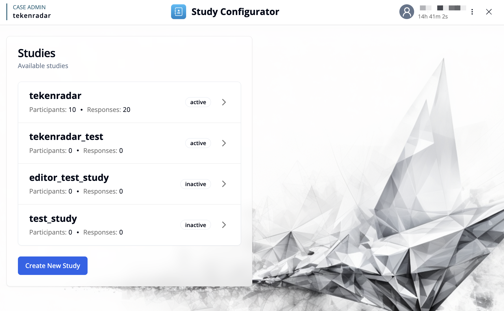
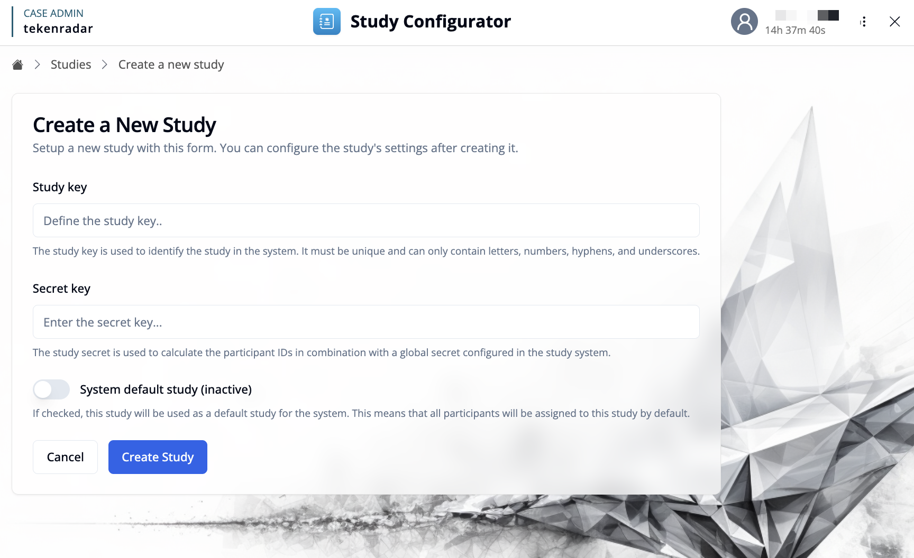

## Overview

The Study Configurator starting page provides access to all studies in the system. From here, you can select an existing study to configure or create a new study.

## Selecting a Study

The main view displays a list of all available studies. Each study is shown with:
- **Study Key**: The unique identifier for the study
- **Participants**: The number of registered participants in the study
- **Responses**: The total number of submitted survey responses
- **Status**: The current status (e.g., active, inactive)

To open the Study Configurator for a specific study, click on the study card or the arrow button on the right. This will take you to the [Study Configurator Dashboard](/docs/study-configurator/configurator-overview) for that study.

## Creating a New Study

To create a new study, click the **"Create New Study"** button. This will open a form where you can configure the basic settings for the new study:

- **Study Key**: Enter a unique identifier for the study. This key is used to identify the study in the system and must be unique. It can only contain letters, numbers, hyphens, and underscores, and cannot be changed later.
- **Secret Key**: Enter a secret key for the study. The study secret is used to calculate the participant IDs in combination with a global secret configured in the study system.
- **System default study (inactive)**: Optionally, enable this toggle to set the study as the default study for the system. This means that all participants will be assigned to this study by default.

After entering the required information, click **"Create Study"** to create the study. You will be automatically taken to the [Study Configurator Dashboard](/docs/study-configurator/configurator-overview) for the newly created study, where you can start configuring surveys, rules, variables, and settings.
