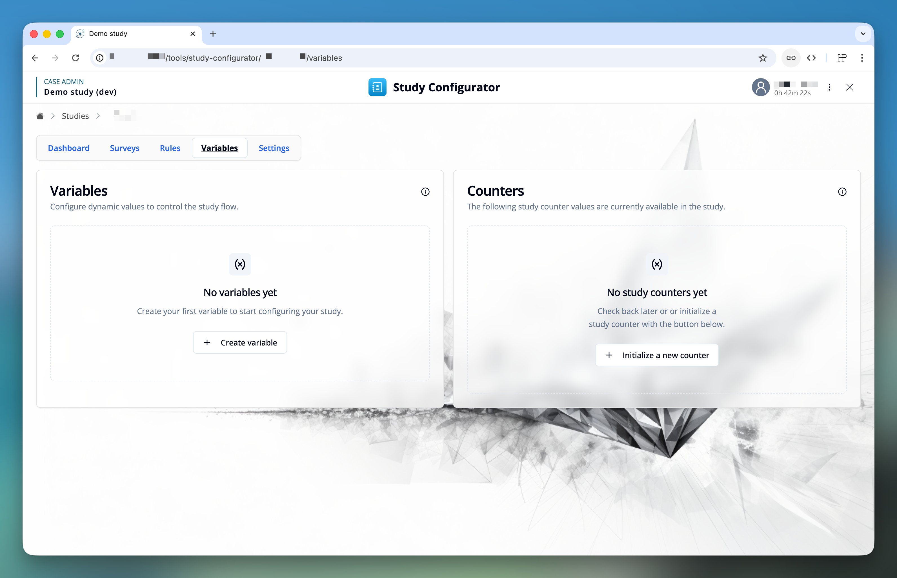
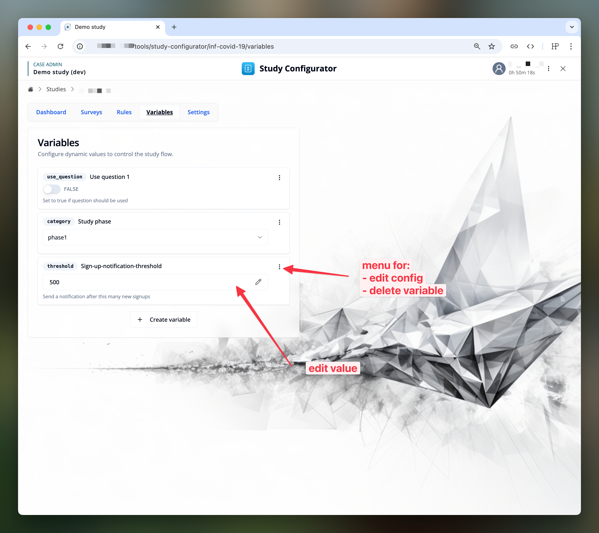
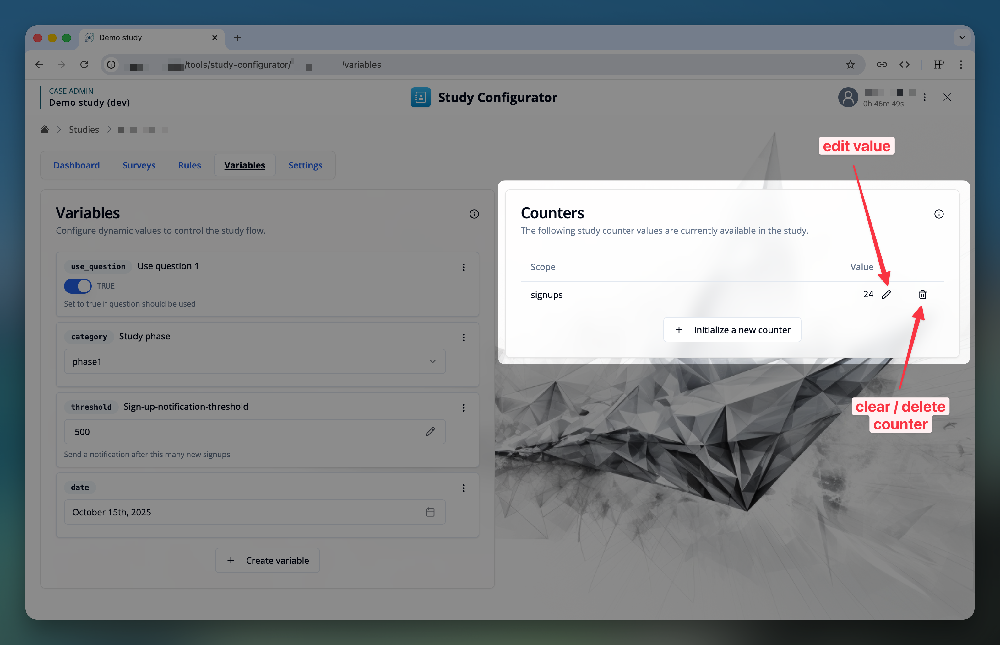

import { ImageZoom } from 'fumadocs-ui/components/image-zoom';
import { Step, Steps } from 'fumadocs-ui/components/steps';
import { TypeTable } from 'fumadocs-ui/components/type-table';

import studyVariablesConfig1Img from './images/variable-config-1.png';
import studyVariablesConfig2Img from './images/variable-config-2.png';

## Introduction

### Study Variables
Study variables add the capability for study administrators to dynamically steer the behavior of the study system, without the need to change the study rules or questionnaires.
While "participant flags" provide a way for individualized logic, study variables provide a simple way to control dynamic “global” (study specific) behavior.

A study variable has a reference key (unique within the study), a value and a value type.
The value type can be one of the following: `string`, `integer`, `float`, `boolean`, `date`

Each study can have its own set of study variables. The study administrator can manage them (create, edit value or configuration, delete).
For improved readability, the study administrator can also assign a human-readable label and description to each study variable.

<ExampleBox title="Use Cases">

- **Flag:** Set a flag to true or false to control the visibility of a question or section.
- **Category:** Choose from a dropdown to change the study flow (e.g., phase1 -> phase2, with different behavior for each phase)
- **Threshold:** Set a threshold for a numeric value to trigger a specific action (e.g., if study-counter reaches the threshold, send a researcher notification.)
</ExampleBox>

### Counters

A study counter is always an integer number and can be incremented by study rules or study actions [(see also)](/docs/study-rules-editor/basics/study-rules/#4-increment-and-get-study-counter-value). Each counter has a scope key, which is used to identify the counter within the study.

<TypeTable
  type={{
    scope: {
      description: 'Scope of the counter within the study',
      type: 'string',
      required: true,
    },
    value: {
      description: 'Current value of the counter',
      type: 'integer',
      default: '0',
    },
  }}
/>

Counters can be used to track different aspects of the study, and their values can be accessed by study expressions in the study engine [(see also)](/docs/study-rules-editor/basics/study-rules/#3-get-current-study-counter-value).

<ExampleBox title="Use Cases">
- **Event count:** Track the number of events that have occurred in the study. E.g., if a participant sends in a specific combination of answers, increment the counter.
- **Participant counter:** Track the number of participants in the study. Count all or eligible participants. This was used for example to assign a unique study code to each participant.
</ExampleBox>

## Managing Study Variables

The management of study variables is available in the **"Study Configurator"** module, under the **"Variables"** tab.

### Creating a Study Variable

To create a new study variable, click the **"Create variable"** button. This will open a modal with the editor interface for the study variable.

<Steps>
<Step>
Enter a unique identifier **`key`** for the study variable. This key is used to reference the study variable in other parts of the application.

<ImageZoom
className='p-2 bg-neutral-200 rounded-xl mx-auto'
src={studyVariablesConfig1Img}
width={400}
height={200}
alt="Study variables configuration 1"
/>
</Step>

<Step>
Select the value type of the study variable. (`string`, `integer`, `float`, `boolean`, `date`)
</Step>

<Step>
(Optional) Enter the **"UI priority"** of the study variable. This determines the order of study variables in the list — higher values appear first.
</Step>

<Step>
Click **"Next"** to open the **"Configuration"** tab.
</Step>

<Step>
(Optional) Enter a **"Label"** for improved readability in the list, in case the key is not self-explanatory.
<ImageZoom
className='p-2 bg-neutral-200 rounded-xl mx-auto'
src={studyVariablesConfig2Img}
width={400}
height={200}
alt="Study variables configuration 2"
/>
</Step>

<Step>
(Optional) Enter a **"Description"** for even more context in the list. This will be shown below the value controller in the list.
</Step>

<Step>
Type-specific configuration for the study variable, depending on the value type. For example, for numbers and dates you can define a minimum and maximum value. For string variables, you can choose between a dropdown with predefined options or a free-text input field.
</Step>

<Step>
Click **"Create"** or **"Save"** to add or update the study variable.
</Step>
</Steps>

### Editing a Study Variable

- To edit the "value" of a study variable, you can use the value input controller in the variable list directly. Depending on the value type, this might be a simple switch, a datepicker or a text/number input.
- To edit the "configuration" of a study variable, use the three-dot menu on the right of the variable's card, and select **"Edit configs"**.
- To delete a study variable, use the three-dot menu on the right of the variable's card, and select **"Delete"**.

## Using Study Variables

Values of the study variables can be used in the following places:
#### **Study rules/study actions** (server-side):
    - expressions: retrieve and use the value of the study variable in a condition or as a parameter of an expression
    - available study expressions: [conditional expressions](/docs/study-rules-editor/basics/study-rules#study-bool-study-variables) or [numerical](/docs/study-rules-editor/basics/study-rules#study-int-study-variables) and [text](/docs/study-rules-editor/basics/study-rules#study-string-study-variables) expressions.
    - actions: [update](/docs/study-rules-editor/basics/study-rules#study-update-study-variables) the value of the study variable
#### **Survey conditions** (client-side):
    - expressions: retrieve and use the value of the study variable in the condition
    - available survey expressions: [conditional expressions](/docs/survey-editor/basics/conditions#survey-bool-study-variables) or [numerical and text expressions](/docs/survey-editor/basics/conditions#survey-num-study-variables).

Other applications specific usage might be available if the application supports it.

## Managing Counters

The view to manage study counters is available in the **"Study Configurator"** module, under the **"Variables"** tab, next to the study variables.
Currently supported are the following features:
- View all counters with their scope key and value
- Initialize a new counter for a scope with a specific starting value
- Change the value of a counter to a specific value: use this action carefully, considering the impact on the study flow and the study rules. (E.g., if you are using a counter to generate a sequential ID for a participant, changing the value of the counter will affect the ID assignment.)
- Delete a counter: this will remove the counter from the study, until it is initialized again. Initialisation might happen through a study rule or study action, so the counter value for the scope might appear again automatically.

