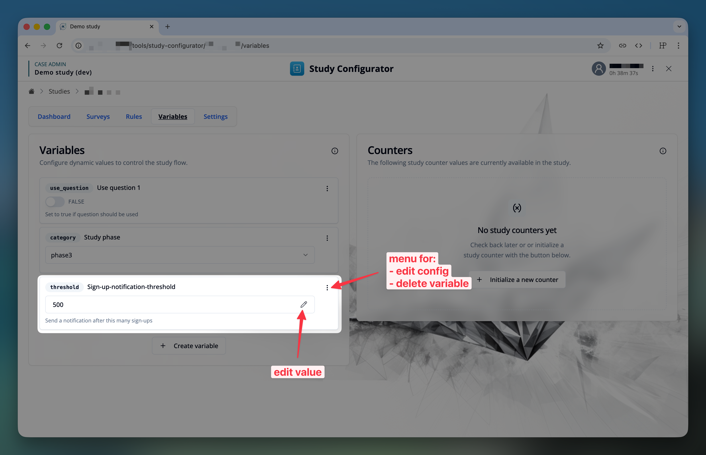

import { ImageZoom } from 'fumadocs-ui/components/image-zoom';
import { Step, Steps } from 'fumadocs-ui/components/steps';

import studyVariablesConfig1Img from './images/variable-config-1.png';
import studyVariablesConfig2Img from './images/variable-config-2.png';

## Introduction

Study variables add the capability for study administrators to dynamically steer the behavior of the study system, without the need to change the study rules or questionnaires.

A study variable has a reference key (unique within the study), a value and a value type.
The value type can be one of the following:
- String
- Number, more specifically: integer or float
- Boolean
- Date

Studies can have its own set of study variables. The study administrator can manage (create, edit value or configuration, delete) study variables.
For improved readability, the study administrator can also assign a human-readable label and description to each study variable.

<ExampleBox title="Use Cases">

- **Flag:** Set a flag to true or false to control the visibility of a question or section.
- **Category:** Choose from a dropdown to change the study flow (e.g., phase1 -> phase2, with different behavior for each phase)
- **Threshold:** Set a threshold for a numeric value to trigger a specific action (e.g., if study-counter reaches the threshold, send a researcher notification.)
</ExampleBox>

## Managing Study Variables

The management of study variables is available in the **"Study Configurator"** module, under the **"Variables"** tab.

### Creating a Study Variable

To create a new study variable, click the **"Create variable"** button.

This will open a modal with the editor interface for the study variable.

<Steps>
<Step>
Enter a unique identifier **`key`** for the study variable. This key is used to reference the study variable in other parts of the application.

<ImageZoom
className='p-2 bg-neutral-200 rounded-xl mx-auto'
src={studyVariablesConfig1Img}
width={400}
height={200}
alt="Study variables configuration 1"
/>
</Step>

<Step>
Select the value type of the study variable. (string, integer, float, boolean, date)
</Step>

<Step>
(Optional) Enter the "UI priority" of the study variable. This is used to determine the order of the study variables in the list, where higher values are shown first.
</Step>

<Step>
Click "Next" to open the "Configuration" tab.
</Step>

<Step>
(Optional) Enter a "Label" for improved readability in the list, in case the key is not self-explanatory.
<ImageZoom
className='p-2 bg-neutral-200 rounded-xl mx-auto'
src={studyVariablesConfig2Img}
width={400}
height={200}
alt="Study variables configuration 2"
/>
</Step>

<Step>
(Optional) Enter a "Description" for even more context in the list. This will be shown below the value controller in the list.
</Step>

<Step>
Type specific configuration for the study variable, depending on the value type. For example, for numbers and dates you can define a minimum and maximum value. For strings, you can define if a select with options should be used or if a text input should be used.
</Step>

<Step>
Click "Create" / "Save" to create / update the study variable.
</Step>
</Steps>

### Editing a Study Variable

- To edit the "value" of a study variable, you can use the value input controller in the variable list directly. Depending on the value type, this might be a simple switch, a datepicker or a text / number input.
- To edit the "configuration" of a study variable, use the three-dot menu on the right of the variable's card, and select **"Edit configs"**.
- To delete a study variable, use the three-dot menu on the right of the variable's card, and select **"Delete"**.

## Using Study Variables