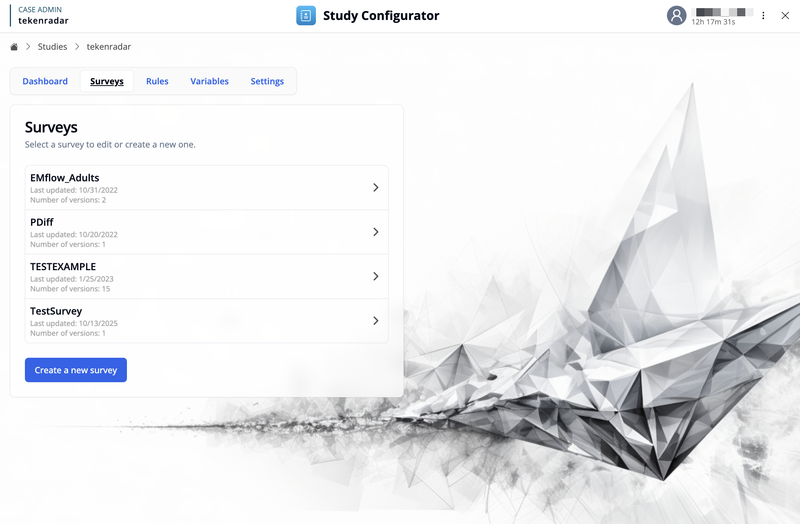
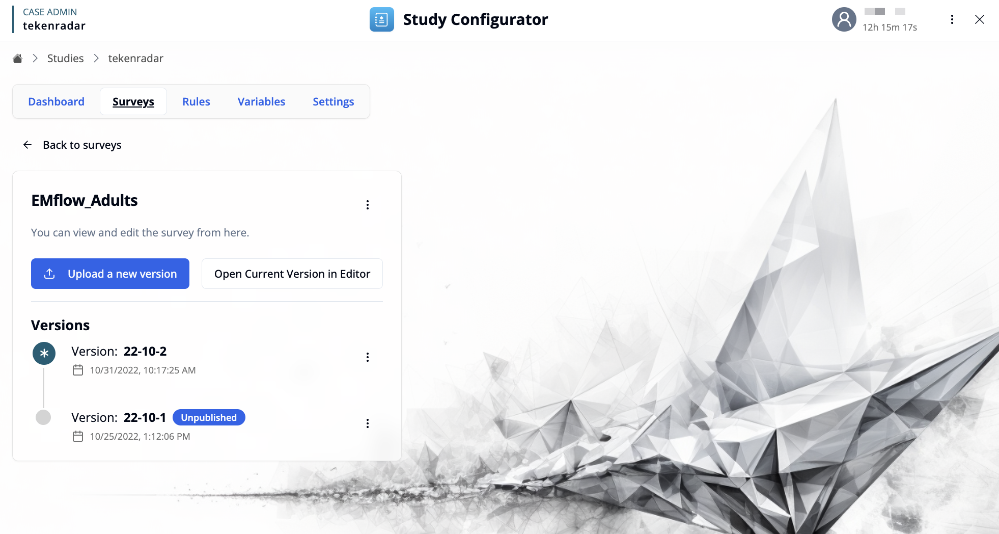
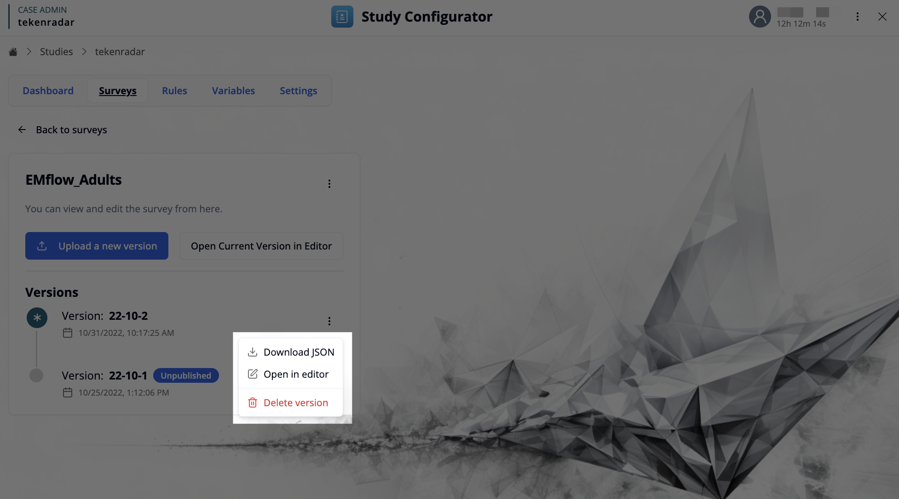

[← Back to Study Configurator Overview](/docs/study-configurator/configurator-overview)

## Interface Layout

The Surveys workspace provides an interface for creating, editing, and organizing all surveys within your study.
All surveys are displayed in a list, with each survey showing:

- **Survey Name**: The unique identifier for each survey 
- **Last Updated**: The date when the survey was last modified
- **Number of Versions**: How many versions exist for each survey, allowing you to track changes over time

### Creating New Surveys

The **"Create a new survey"** button at the bottom of the list provides two options for adding a new survey to your study:

1. **Open Editor**: Launch the visual [Survey Editor](/docs/survey-editor/basics/editor-overview) to design a new survey from scratch. 

2. **Upload Survey File**: Import an existing survey definition file (JSON format) from your computer. 

## Survey Detail View

Click on a survey from the list to see more details of the survey.

### Quick Actions

The detail view offers two primary action buttons:

- **Upload a new version**: Import a survey definition file (JSON format) to create a new version of the survey. 
- **Open Current Version in Editor**: Launch the currently active version in the [Survey Editor](/docs/survey-editor/basics/editor-overview) to modify questions and survey structure.

Additionally, the three-dot menu next to the survey name provides:

- **Unpublish**: Make the survey unavailable for participants.
 
### Version Management

The Versions section displays a chronological list of all survey versions, enabling you to:
- Track changes across different versions
- Decide which version should be active in your study

The version history displays the following information for each version:

#### Version Information
- **Version Number**: A unique identifier (e.g., 22-10-2, 22-10-1)
- **Publication Status**: The last published version appears with a star icon and is actively used in the study
- **Timestamp**: The exact date and time when the version was created or last modified

<Callout type="info">
Only one version can be published at a time. Publishing a new version automatically unpublishes the previously active version.
</Callout>

#### Version Actions
Each version has an options menu (three-dot icon) with the following actions:

- **Download JSON**: Export the survey version as a JSON file for backup or sharing
- **Open in editor**: Load this version in the [Survey Editor](/docs/survey-editor/basics/editor-overview) to review or create a modified copy
- **Delete version**: Permanently remove this version (cannot be undone)

