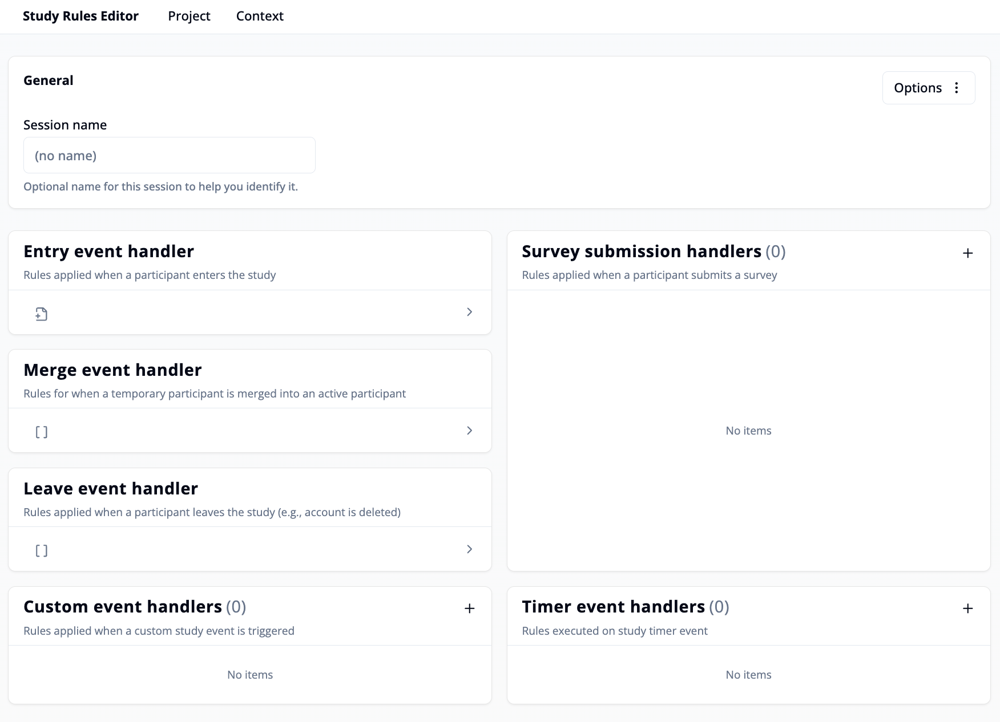
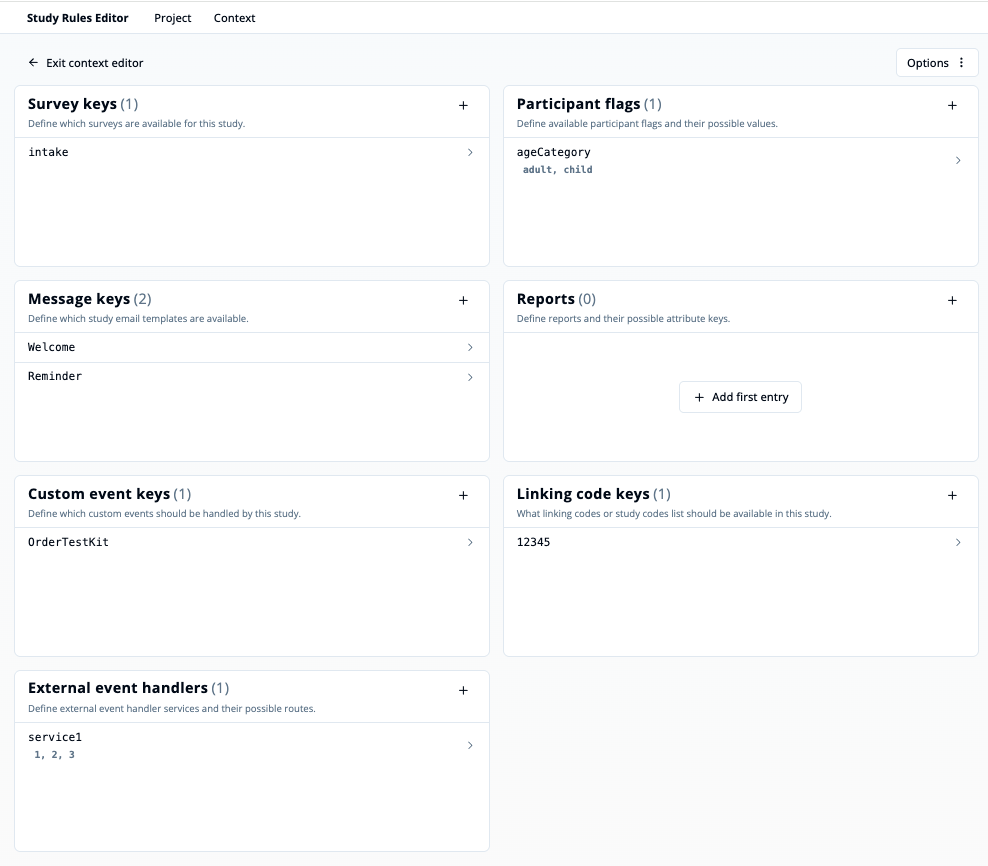

## Introduction

**Study rules** define automated actions that are applied to participants during different stages of a study. They are executed when specific **events** are triggered (e.g., when a participant enters or leaves the study, or when a survey is submitted). Study rules enable you to:

- **Scheduling**: Configure when surveys become available or expire based on time or participant actions
- **Event handlers**: Define actions based on study events (entry, survey submission, timers, etc.)
- **Conditions**: Use variables and participant state to control study behavior and flow

## Study Rules Editor Dashboard

The **Study Rules Editor** is a graphical interface that allows you to create and manage these rules. It provides tools to define event handlers, configure contexts, and automate study workflows and participant management.

### Top Navigation Bar

- **"Project"**: Click here to open an existing project, save your project or export the study rules.
- **"Context"**: The editor context provides access to study and message keys, participant flags, reports and external event handlers that can be referenced in your rules.
You can import a context from a recent session or [create a new one](/docs/study-rules-editor/basics/editor-overview#context-editor) via the **"Open Context Editor"** button.

### General

- **"Session name"**: You can give the current session a name to help identify it later.

- **"Options"**: In the top-right corner, the Options menu lets you save or export your study rules as a file.

---

### Event Handlers

Event handlers define what should happen when a certain event occurs in the study.
Each handler can contain one or more rules that are applied in sequence.

#### 1. Entry event handler
Rules defined here are applied **when a participant enters the study**.

<ExampleBox title="Typical use cases">
- Sending a welcome message
- Assigning an intake survey to collect initial data
- Scheduling a reminder message for the intake survey
</ExampleBox>

#### 2. Survey submission handlers
Rules defined here are applied **when a participant submits a survey**.
You can define multiple handlers (one for each survey).

<ExampleBox title="Typical use cases">
- Deleting the survey assignment and triggering new follow-up assignments
- Updating participant flags based on responses
- Sending notifications to researchers
- Creating reports
- Removing scheduled reminder messages and creating new ones for follow-up surveys.
- Sending data to external services to evaluate survey answers
</ExampleBox>

#### 3. Merge event handler
Rules defined here are applied **when a temporary (or virtual) participant is merged into an active participant account**.

<ExampleBox title="Typical use cases">
- After completing a survey without logging in, the participant decides to create (or use an existing) account and continue with the study
- "Virtual participants" created by researcher accept invitation and sign up with their own account
</ExampleBox>

#### 4. Custom event handler
Rules defined here are executed **when a custom event is triggered**, for example, when a participant clicks a button to order a test kit. Used for small, occasional actions that don't require a survey response.
<ExampleBox title="The handler typically contains methods for">
- Creating a report
- Updating participant flags
- Rescheduling surveys
- Enabling an external event handler
</ExampleBox>

#### 5. Timer event handler
Rules defined here are executed **when a study timer event occurs** (e.g., at scheduled intervals or specific times).

<ExampleBox title="Typical use cases">
- Sending periodic reminder messages
- Scheduling follow-up surveys
- Automatically updating participant data over time
</ExampleBox>

#### 6. Leave event handler
Rules defined here are applied **when a participant leaves the study** (e.g., when their account is deleted or deactivated).

<ExampleBox title="Typical use cases">
- Marking the participant as deleted
- Removing confidential responses from the study database
- Sending a goodbye message
</ExampleBox>

---

## Context Editor

The **Context Editor** is a configuration interface within the **Study Rules Editor**. It allows you to define the keys and identifiers that are used in **event handlers**, **conditions**, and **actions** throughout your study logic. These definitions ensure that all references to surveys, messages, flags, and other elements are valid and consistent.

### How to Access the Context Editor

1. Open the **Study Rules Editor**.
2. Click on the **“Context”** tab in the top navigation bar.
3. Select **"Open Context Editor"**.
4. You will now see a structured overview of all configurable keys used in your study.

### Context Editor Menu Options
At the top of the context editor, you’ll find a dropdown menu with two main options:
- **Exit Context Editor**: Closes the context editor and returns you to the main Study Rules Editor view.
- **Use recent context**: Displays a list of previously used context configurations. You can select one from the list to quickly reopen and continue working with an existing setup.

### Sections of the Context Editor
Each section corresponds to a different type of key or identifier used in your study logic:

#### 1. Survey Keys
Define all surveys that can be referenced in rules.

<ExampleBox title="Use Case">
Assign or remove surveys, check submission status, or schedule based on survey keys.
</ExampleBox>

#### 2. Participant Flags
Define flags that represent participant states or attributes.

<ExampleBox title="Use Case">
Set or check flags like eligibility, group assignment, or progress.
</ExampleBox>

#### 3. Message Keys
Define all messages (e.g., emails or notifications) that can be scheduled or removed.

<ExampleBox title="Use Case">
Trigger sending of onboarding, invitation, or reminder messages
</ExampleBox>

#### 4. Reports
Define report keys and their attribute keys.

<ExampleBox title="Use Case">
Initialize, update, or cancel reports with structured data.
</ExampleBox>

#### 5. Custom Event Keys
Define custom events that can be handled by the study.

<ExampleBox title="Use Case">
Trigger rules based on external or participant-driven events.
</ExampleBox>

#### 6. Linking Code Keys
Define which linking codes or study-wide code lists are available.

<ExampleBox title="Use Case">
Assign or remove codes used for participant grouping or access.
</ExampleBox>

#### 7. External Event Handlers
Define external services and their available routes.

<ExampleBox title="Use Case">
Send data to external systems or trigger external workflows.
</ExampleBox>

### Adding or Editing Entries
- Click the **“+”** button next to any section to add a new key.
- Edit existing entries by clicking on them directly.
- For Participant Flags, Reports and External Event Handlers, you can define possible values for corresponding keys.
- Remove keys by right-clicking on them and selecting the **"Delete Entry"** option.

### Options Menu
- Use the **“Options”** button in the top-right corner to save your context to file or open a new context from file.

---

For a complete list of available expressions and actions you can use in your study rules, see the [Methods of the study engine](/docs/study-rules-editor/basics/study-rules).
