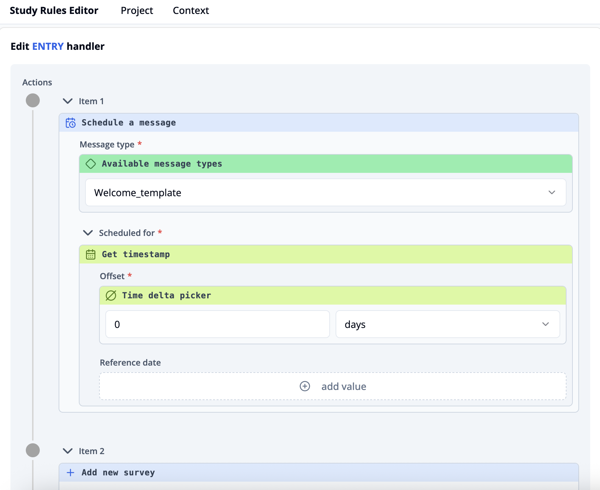

import { Step, Steps } from 'fumadocs-ui/components/steps';

This example shows how to configure actions that are executed automatically when a participant enters the study. 
We’ll use the case where a **welcome message** is sent, the **intake survey** is assigned, and a **reminder message** for submitting the intake survey is scheduled.

## Prerequisite
Before you can configure ENTRY actions, make sure the Survey keys and Message keys are already defined in the [Survey context](/docs/study-rules-editor/basics/editor-overview#context-editor).

Needed for this example:
- Survey keys: `intake`
- Message keys: `Welcome`, `Reminder`

<Video videoPath="/videos/ENTRY-event.mp4" />

## Follow these steps
<Steps> 
<Step> 
In your study rules dashboard, click the **"Entry event handler"** section.
</Step> <Step> 
In the ENTRY handler editor, click **"+ add value"**. From the list of available actions, select **"Schedule a message"**. 
</Step> <Step> 
Choose the message type `Welcome` you defined in your survey context. 
</Step> <Step>
 Under **"Scheduled for"**, keep **"Get timestamp"** and keep the **offset** at *0 days*. This ensures the welcome message is sent immediately when the participant enters. 
 
</Step> <Step> 
 Add another action by clicking **"+ add value"** and select **"Add new survey"**. 
</Step> <Step>
  Select the survey key `intake`. 
</Step> <Step>
Use the **"Available from"** field if you want the survey to become available at a specific future time: Add the expression **"Get timestamp"** to insert the current time, then adjust the offset (e.g., add *30 minutes* or any desired delay).  
   Leave **"Available until"** empty if the survey should remain available indefinitely.
</Step> <Step> 
  Add a third action: click **"+ add value"** and select **"Schedule a message"**. 
</Step> <Step> 
  Choose the message `Reminder`. 
</Step> <Step> 
  Under **"Scheduled for"**, set an offset such as *3 days*. This ensures the reminder message is sent 3 days after the participant's entry. 
</Step> <Step> 
  Your ENTRY event will now automatically: 
    1. Send a welcome message immediately. 
    2. Assign the intake survey. 
    3. Schedule a reminder message after the defined delay. 
</Step> </Steps>