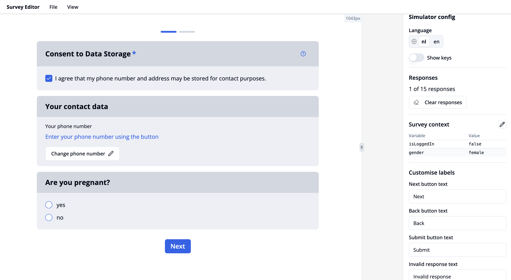

## Survey Editor Dashboard

This dashboard shows you the key content and structure of your survey.

### Top Navigation Bar
- **Survey Editor**: displays the currently open editor.
- **File**: Click here to generate a new survey, open an existing survey, save survey to disk or exit survey editor.
- **View**: Click here to go to [Survey Properties](/docs/survey-editor/basics/editor-overview#survey-properties-workspace) section or Survey Simulator.
- **Survey Name:** Top left shows the unique key name of the current survey. Click on it to change its root key name.
- **Survey label**: Top center displays the survey label. You can rename the survey label by clicking on it.
- **Color Selector**: Click here to change the theme color of the survey.
- **Three-Dot Menu (Top Right):** Provides besides normal mode additional actions for the survey:
    - `Source code` – View or edit the raw JSON structure of the survey.
    - `Copy` – Duplicate the survey. You can paste the survey in another survey by adding it as an item to the other survey.
    - `Move to other group` – Move item to another group of questions.
    - `Delete item` – Permanently remove the survey.

### Survey Item List
- **Items**: This section lists all the [items](/docs/survey-editor/basics/item-structure#survey-items) of the survey. Each item has:
    - an icon symbolizing the type of question (e.g. checkmark in circle for single choice question)
    - an unique **Item Key** (e.g., `SCG1`).
    - an optional **Label** text (e.g., `Single Choice Question`).
- Open the [item interface](/docs/survey-editor/basics/item-structure#item-interface) by clicking on the item or its icon shown in the left bar.
- New items can be added by
    - Click on **+ Add new item** at the bottom of the item list
    - Click on **+** in the left sidebar.
- Items can be ordered by
    - drag and drop them in the item list or left sidebar or
    - toggle the switch `Use random ordering` in the **Item ordering** section to random order items when the survey runs.
- **Condition tab**: Switch to this tab to define [conditional logic](/docs/survey-editor/basics/conditions#conditions-and-expressions) that controls when items should be shown based on participant responses.

---

## Survey Properties Workspace

The **Survey Properties** workspace allows you to define and manage overall configuration and behavior of your survey.
Click on **View** dropdown menu and select **Survey Properties** to open this section (shortcut **⌘ Cmd + 1**).

### Overview of Functions

- **Basic Information**
  - **Title**
    Enter a title of the survey that will be displayed in the participant app.

  - **Description**
    Provide a brief summary of the survey’s purpose. This helps users understand the context or objective before starting.

  - **Duration Notice**
    Add an estimated time required to complete the survey.

  - **Language Selection (Top Right)**
    Use the language toggle to view and edit content in different languages. This helps manage multilingual surveys efficiently.

- **Access Conditions**
  Configure who is allowed to access and complete the survey.
  - **Available for**
    Select a group of users who should be able to see and access the survey. Common options include:
        - **Everyone**
        - **Active participants**
        - **Temporary participants**
        - **Assigned participants**
  - **Submission requires Login**
    Enable this toggle if participants must be logged in to submit their responses. If disabled, anyone with access to the survey can submit a response.

- **Max Items per Page**
  Set the maximum number of question or content items that should appear on a single survey page for small and large screens.
  This is useful for optimizing readability and user experience across different devices.
  Instead you can use page breaks to control the number of items per page if the number of items per page is variable.

---

## Simulator

The simulator allows you to preview and test your survey questions under different conditions. This interface helps you simulate participant interactions and verify how your survey behaves in different scenarios, such as varying context variables or translations.
Below are the key components visible in the interface:

### Survey Items

This section shows the survey items that you have added and configured. It includes:

- **Question components**, such as single-choice, multiple-choice, input fields, consent checkboxes, etc.
- **Conditional visibility**: Items are shown or hidden based on the current survey context or previous responses.
- **Section headers and info text** to organize and explain your survey.
- **Randomized question order** can be tested.

### Simulator Config Panel (Right Side)

#### Language Toggle
- Allows switching between available languages (e.g. `nl`, `en`).

#### Key Toggle
- Toggle “Show keys” to display the item keys.

#### Responses
- Displays how many responses are filled in out of the total.
- **Clear responses** button resets all current inputs.

#### Survey Context
- Lists current **context variables** and their values. These variables influence logic and conditional rendering of survey items. You can edit the context variables by clicking on the pencil. 
[See this example on setting participant flags.](/docs/survey-editor/guides/show-part-flag-question#show-a-question-based-on-a-participant-flag)
 
#### Customize Labels
- Configure text for:
  - **Navigation buttons**: **"Next"**, **"Back"**, **"Submit"**
  - **Validation**: **"Invalid response message"**

### Navigation & Layout

- A **progress bar** indicates the user's position within the survey flow.
- A **navigation button** (e.g., "Next") is shown at the bottom to proceed to the next page or submit responses.

