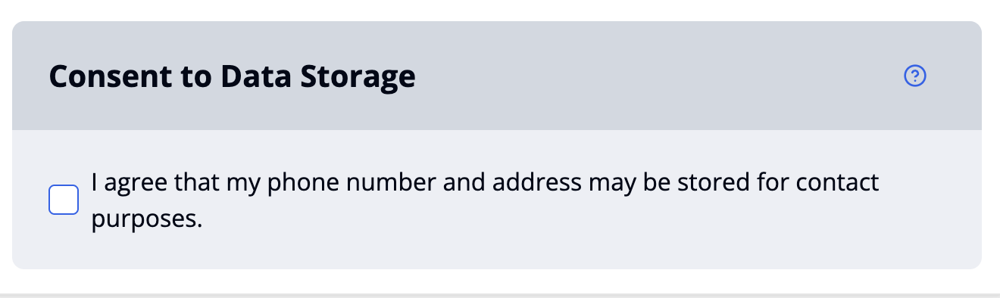
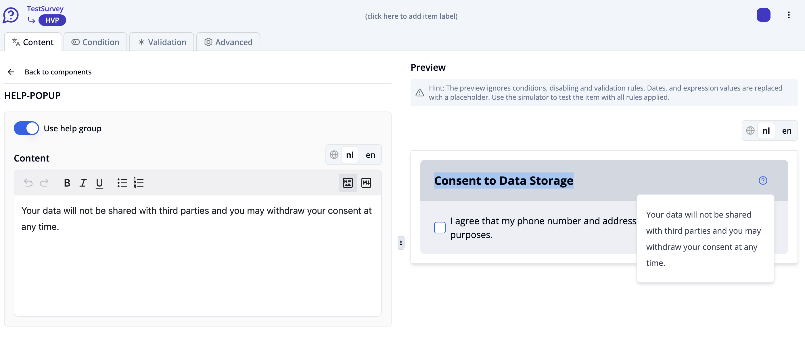

import { Step, Steps } from 'fumadocs-ui/components/steps';

This guide shows you how to create more advanced question flows using conditions and validations. 
We'll use a consent question as an example, followed by a contact form that only becomes visible when consent is given.

<Steps>
<Step>
Click the plus icon in the left toolbar or the **"Add a new item"** button in the **"Items"** tab.
</Step>
<Step>
Select the option **"Question or Info item"**.
</Step>
<Step>
Select the option **"Consent"**. The consent item is now shown in your item list. Click on the item to see the content item interface.
</Step>
<Step>
Select the component you would like to edit by clicking on it (Read more about [item components](/docs/survey-editor/basics/item-structure#survey-items)).
</Step>
<Step>
Write your title text e.g. "Consent to Data Storage" in the text field of the title component. Go back to consent item interface.
</Step>
<Step>
Click on **"Response options"** and write the consent text in Label text field. Your item now looks like this:

</Step>
<Step>
Clicking on the label text during the survey will open a detailed consent dialog. Write the title of the dialog in **.
</Step>
<Step>
Write the content of the dialog in content field. 
</Step>
<Step>
The dialog includes two buttons: 'Reject' and 'Accept'. You can customize their labels by editing the fields labeled 'Accept button' and 'Reject button'.
</Step>
<Step>
Go back and click on the Help/Info popup.
</Step>
<Step>
 Toggle the switch **"Use help group"** and add additional info text in the content field: 

</Step>
<Step>
Click the plus icon at the bottom of the left toolbar.
</Step>
<Step>
Choose **"Question or Info Item"** and then **"Contact Form Question"**. This will display the contact item configuration interface.
</Step>
<Step>
Write your title text e.g. "Contact data" in the text field of the title component. 
</Step>
<Step>
Click on **"Response options"**.
</Step>
<Step>
 Briefly describe in the label field what the user is expected to enter, e.g. "Your address".
 </Step>
<Step>
Write your text in the preview placeholder field e.g.: **"Enter your address using the button."**. This helps guide the user before they open the dialog.
</Step>
Edit the label on the button the user clicks to open the contact form dialog, e.g. "Change address"
<Step>
</Step>
Enter the title that appears at the top of the popup dialog where the user enters their information, e.g. "Your Contact details".
<Step>
</Step>
Provide context inside the dialog description field, e.g., why you're asking for contact details: "Please provide your contact information so we can reach you if needed."
<Step>
 </Step>
</Steps>
