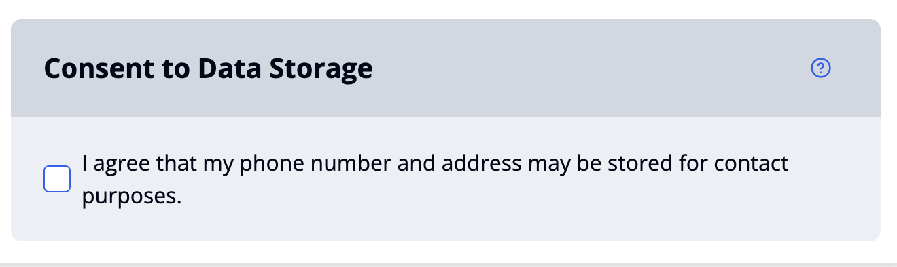
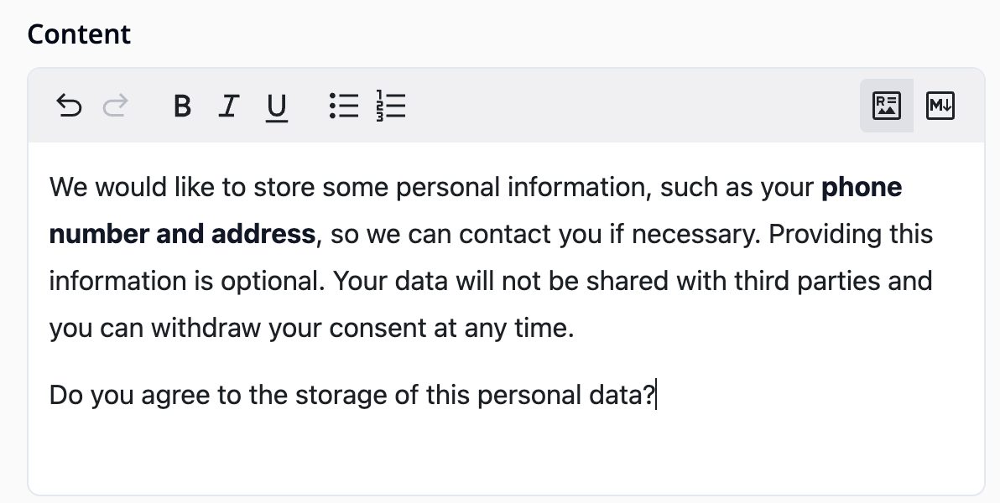

import { Step, Steps } from 'fumadocs-ui/components/steps';

This guide shows you how to create more advanced question flows using conditions. 
We'll use a consent question as an example, followed by a contact form that only becomes visible when consent is given.

### First: Build Consent Question

<Video videoPath="/videos/consent.mp4" />

<Steps>
<Step>
Click the plus icon in the left toolbar or the **"Add a new item"** button in the **"Items"** tab.
</Step>
<Step>
Select the option **"Question or Info item"**.
</Step>
<Step>
Select the option **"Consent"**. The consent item is now shown in your item list. Click on the item to see the content item interface.
</Step>
<Step>
Select the component you would like to edit by clicking on it (Read more about [item components](/docs/survey-editor/basics/item-structure#survey-items)).
</Step>
<Step>
Write your title text e.g. *"Consent to Data Storage"* in the text field of the title component. Go back to consent item interface.
</Step>
<Step>
Click on **"Response options"** and write the consent text in the label text field e.g. *"I agree that my phone number may be stored for contact purposes"*. Your item now looks like this:

</Step>
<Step>
Clicking on the label text during the survey will open a detailed consent dialog. Write the title of the dialog in **"Dialog title"**, e.g. *"Can We Store Your Contact Details?"*.
</Step>
<Step>
Enter the dialog content in the **“Content”** field. You can also format your text or add bullet points:

</Step>
<Step>
The dialog includes two buttons: **Reject** and **Accept**. You can customize their labels by editing the fields labeled **"Accept button"** and **"Reject button"**.
</Step>
<Step>
Go back and click on the Help/Info popup.
</Step>
<Step>
 Toggle the switch **"Use help group"** and add additional info text in the content field: 

You’ve successfully configured the consent item. It’s now ready for use.
</Step>
</Steps>

### Second: Build Contact Form 

<Video videoPath="/videos/contact.mp4" />

<Steps>
<Step>
Add a contact form item by clicking the plus icon at the bottom of the question list on the left-hand side.
</Step>
<Step>
Choose **"Question or Info Item"** and then **"Contact Form Question"**. This will display the contact item configuration interface.
</Step>
<Step>
Write your title text e.g. *"Contact data"* in the text field of the title component. 
</Step>
<Step>
Click on **"Response options"**.
</Step>
<Step>
 Briefly describe in the label field what the user is expected to enter, e.g. *"Your phone number"*.
 </Step>
<Step>
Write your text in the preview placeholder field e.g.: *"Enter your phone number using the button."*. This helps guide the user before they open the dialog.
</Step>
<Step>
Edit the label on the button the user clicks to open the contact form dialog, e.g.*"Change phone number"*.

</Step>
<Step>
Enter the title that appears at the top of the popup dialog where the user enters their information, e.g. *"Your Contact details"*.
</Step>
<Step>
Provide context inside the dialog description field, e.g., why you're asking for contact details: *"Please provide your contact information so we can reach you if needed."*
 </Step>
 <Step>
 Customize the **Cancel**, **Reset**, and **Save** button labels as needed.
 </Step>
 <Step>
 Toggle the switch **“Use field”** next to **"Phone"** to add the phone number field to your contact dialog.
 </Step>
 <Step>
 Enter the text in the label field that will appear above the phone input e.g. *"Phone number"*
</Step>
 <Step>
Enter a **placeholder text** that will appear inside the input box before the user types anything *"e.g. +49 172 1234567"*.
</Step>
 <Step>
Add a **regular expression** to define the required input format e.g. (international format): `^\+\d{1,4}\s?\d{3,}$`
</Step>
 <Step>
Provide an optional **hint text** shown below the input field to give the user more guidance e.g.
  *"Use international format starting with + followed by country code."*.
</Step>
 <Step>
  Enter the **error message** that should be displayed if the input does not match the pattern e.g.
  *"Please enter a valid phone number in international format."*. The editor and preview of the final dialog are shown below.
  
  
  </Step>
  <Step>
To add other fields like **Address**, **Full Name**, **Email**, or **Company Name**, simply toggle the corresponding switch and configure the settings as needed.
  </Step>
  <Step>
 Go to the "Condition" tab to define conditional logic for the question. The contact form should only be shown if consent to store contact data is given.
</Step>
  <Step>
Click **“+ add value”**.
</Step>
  <Step>
In the dropdown menu, scroll to the Templates section and select **“Consent question accepted”**.
</Step>
  <Step>
  Enter the item key of the consent question. Tip: You can find the key by hovering over the question icon in the left sidebar.
  
  </Step>
  <Step>
  A response slot key is not required. Use the survey [simulator](/docs/survey-editor/basics/editor-overview#simulator) to verify that the conditional logic works as expected.
</Step>
</Steps>
