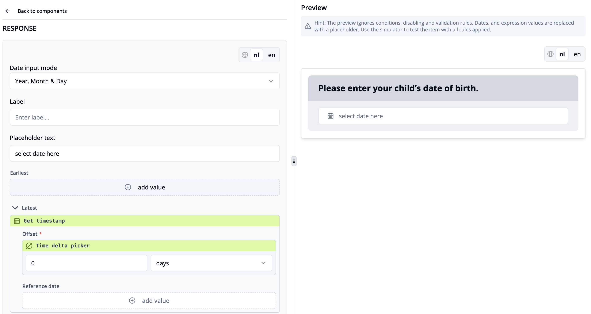

import { Step, Steps } from 'fumadocs-ui/components/steps';

This guide shows how to configure and connect two date questions that validate answers with minimum and maximum time constraints.

<Steps>
<Step>
Create a date question by clicking the plus icon in the left toolbar or the **"Add a new item"** button in the **"Items"** tab and selecting **"Question or Info item"**.
</Step>
<Step>
Select the option **"Date Input"**. The date item is now shown in your item list. Click on the item to see its interface.
</Step>
<Step>
Select the component you would like to edit by clicking on it (Read more about [item components](/docs/survey-editor/basics/item-structure#survey-items)).
</Step>
<Step>
Write your title text. In our example, the title text is: *"What is your child’s date of birth?"*.
</Step>
<Step>
Click on **"Response options"**. Set the **Date input mode** to *Year, Month & Day* so that participants can provide a complete birth date.
</Step>
<Step> 
Enter optional **Label** and **Placeholder text**, such as *"select date here"*, to guide participants before they make a selection. 
</Step> 
<Step> 
Under **Earliest**, you can define the minimum possible date. For a birth date question, this is usually left open, since the child may be any age. 
</Step> 
<Step> 
Under **Latest**, set the maximum possible date. Click **+ add value**. 
</Step> 
<Step> 
In the dropdown menu, scroll to the  **Misc** section and select **“Get timestamp"**. Keep the **Offset** at *0 days*, so that the latest valid date is today. This ensures that participants cannot select a date in the future.

</Step> 
<Step>
Create another date question. In our example, the title text is:  
*"When was your child’s last vaccination?"*
</Step>
<Step> 
Set the **"Date input mode"** to **"Year, Month & Day"**. 
</Step>
<Step> 
In the **Earliest** field, click **+ add value** and select **"Get response value as number" in the **Response dependencies** section.
</Step>
<Step> 
In the **Item key** field, click **"+ add value"** and then **"Available item keys"**. Choose the **item key** of the previous date question. For response slot key add "rg.date". This ensures that the vaccination date cannot be set earlier than the child’s date of birth. 
</Step> 
<Step> 
In the **Latest** section, click **+ add value**. 
</Step> 
<Step> 
Select **"Get timestamp"**. Leave the **Offset** at *0 days*. This restricts the latest possible vaccination date to *today*. 
</Step>
<Step> 
Use the survey [simulator](/docs/survey-editor/basics/editor-overview#simulator) to verify that your constraints are as expected.
</Step> 
</Steps>

**Note**: “Today” is evaluated in the participant’s local timezone. Participants in different timezones may see slightly different date boundaries on the same UTC day.
