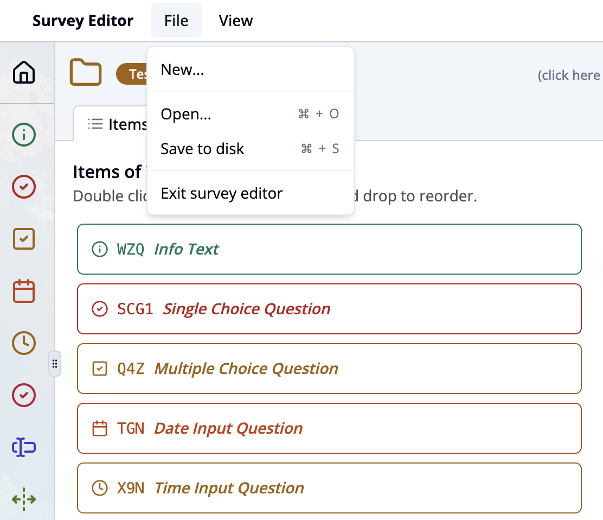
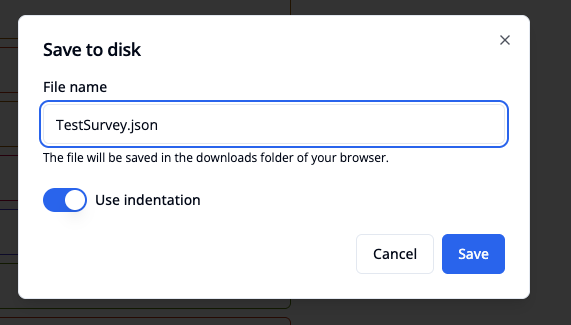

import { Step, Steps } from 'fumadocs-ui/components/steps';

<Steps>
<Step>

Click on the **“File”** menu at the top of the editor.

</Step>
<Step>

Select **“Save to disk”** (or press **⌘ + S**).

</Step>
<Step>

Enter a file name (e.g. MySurvey.json) in the dialog window.

</Step>
<Step>

Optionally, enable “Use indentation” to make the file more readable.

</Step>
<Step>

Click Save. The file will be saved in the Downloads folder of your browser.

</Step>

You can later reopen the file using “File" and choosing  **"Open…”** (or **⌘ + O**).

</Steps>
