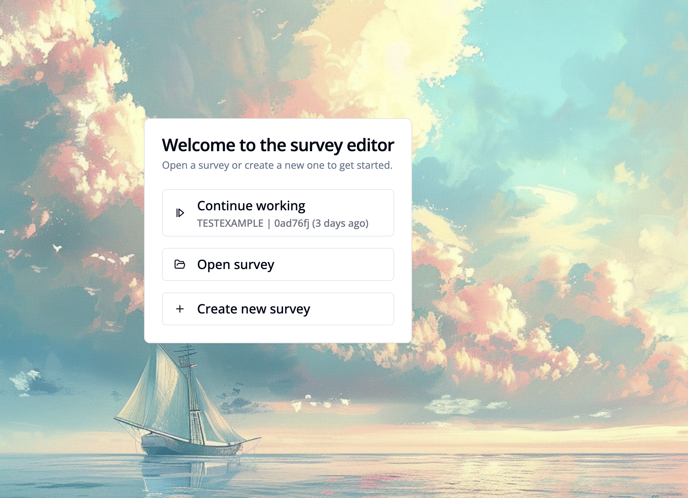

import { Step, Steps } from 'fumadocs-ui/components/steps';

This guide shows how to create a new survey in the Survey Editor.

<Video videoPath="/videos/create-survey.mp4" />

<Steps>
<Step>

Go to **"Standalone editor"**.

</Step>
<Step>

Choose section **"Survey editor"**.

</Step>
<Step>

Click the **"Create new survey"** button and enter a **survey key**.

</Step>

You are now ready to edit your new survey! Learn more about how to configure the editor interface [here](/docs/survey-editor/basics/editor-overview#survey-editor-dashboard).

<Step>
4. Click **"View"** and choose **"Survey Properties"** to define your [survey properties](/docs/survey-editor/basics/editor-overview#survey-properties-workspace) e.g. title, language or access conditions.
</Step>
</Steps>
