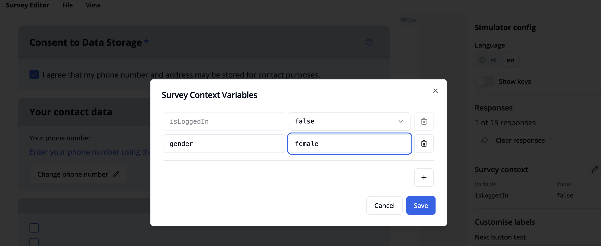
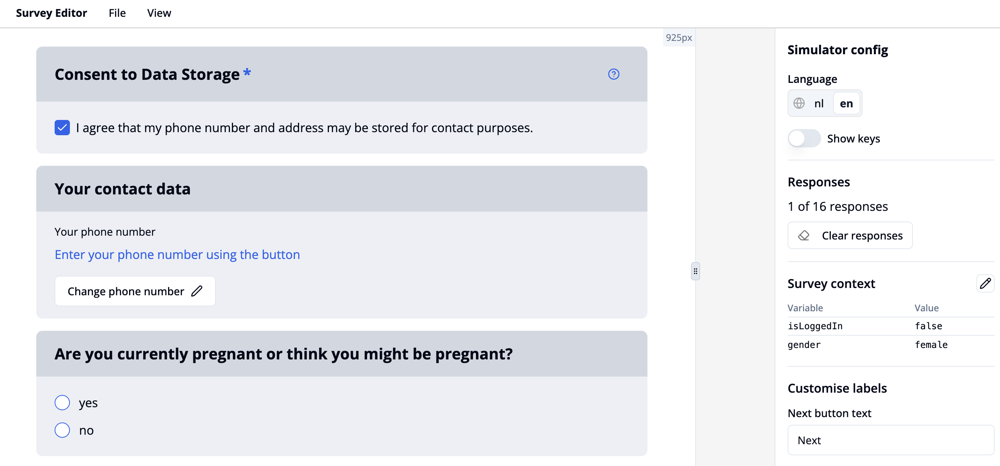

import { Step, Steps } from 'fumadocs-ui/components/steps';

This example shows how to display a question only if a participant flag has a certain value. We’ll use the case where a pregnancy question is shown only when the gender flag is set to female.

<Steps>
<Step>
Create a single choice question as described [here](/docs/survey-editor/guide/add-single-choice). In our example the title text is *"Are you currently pregnant or think you might be pregnant?"* with options *"yes"* and *"no"*.
</Step>
<Step>
Go to the **"Condition"** tab to define conditional logic. Click **“+ add value”**.
</Step>
  <Step>
In the dropdown menu, scroll to the Participant Flags section and select **“Participant flag with key and value exists"**.
</Step>
<Step>
Enter *"gender"* in the **key** text input field and *"female"* in the **value** text input field.
</Step>
<Step>
Go to the survey simulator by clicking **"View"** in the top toolbar and selecting **"Simulator"**.
</Step>
<Step>
You can now simulate a female participant by adding a *"gender-female"* pair in the context list. Therefore, click the pencil icon next to **"Survey context"** in the right-hand panel. A modal window titled **"Survey Context Variables"** will open.
</Step>
<Step>
Click the plus button to add a new variable.
</Step>
<Step>
In the left field, enter the variable name: *"gender"*.
</Step>
<Step>
In the right field, enter the value: *"female"*: 

</Step>
<Step>
Click **Save** to confirm.
</Step>
<Step>
Your Survey Context should now include `gender - female`, and the single choice question should be visible.

</Step>
</Steps>
