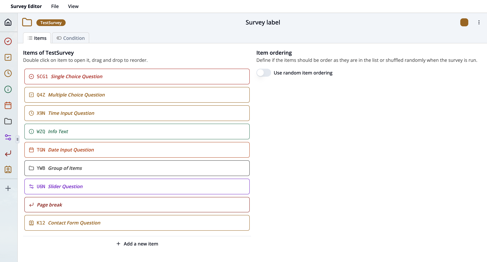
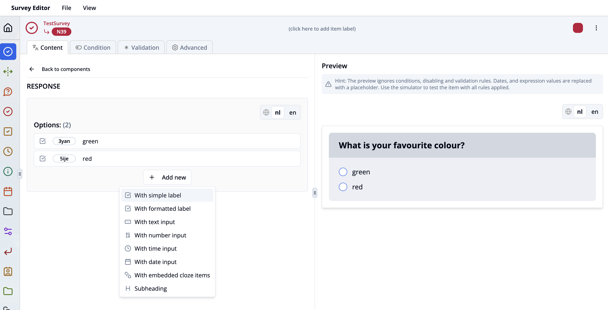

## How to set up a simple survey

1. Go to **"Standalone editor"**.
2. Choose section **"Survey editor"**.
3. Click the **"Create new survey"** button and enter a **survey key**.

You are now ready to edit your new survey! Learn more about how to configure the editor interface [here](/docs/survey-editor/basics/editor-overview#survey-editor-dashboard).

4. Click **"View"** and choose **"Survey Properties"** to define your [survey properties](/docs/survey-editor/basics/editor-overview#survey-properties-workspace).

## Add a single choice question

1. Click the plus icon in the left toolbar or the **"Add a new item"** button in the **"Items"** tab.
2. Select the option **"Question or Info item"**.
3. Select the option **"Single choice"**. The single choice item is now shown in your item list. Click on the item to see this editor interface:

4. Select the component you would like to edit by clicking on it (Read more about [item components](/docs/survey-editor/basics/item-structure#survey-items)).
5. Write your question in the text field of the title component. Add additional information in the text field of the subtitle. Write optional text before or after response options in top and bottom content components.
6. Remarks and help text can be written in the help/info popup or footnote.
7. Click on **"Response options"**. Click the **“+ Add new”** button under the **Options** section.
8. Add a Simple Option by Selecting **“With simple label”**. A new row appears where you can enter the response label (e.g., `blue`, `yes`, `no`, etc.). This adds a basic option where participants can select just the label text.
9. Create more dynamic and interactive response options by choosing options with number, date, time or text user input. Select  **With embedded cloze items** to combine static text and response fields in one line.
10. Select **With formatted label** to use rich text (bold, italic, etc.) in label. Select **Subheading** to group or separate options visually for better structure.

11. Enter label text of options for different languages by switching the language tabs above the options list. This ensures participants see the options in their selected language.
12. Define optional [conditions](/docs/survey-editor/basics/conditions) to control whether an option is shown or disabled. Select the option row and click on **"Show more settings"**. Use the **Display** condition to show the option only under certain criteria, and the **Disabled** condition to keep it visible but prevent selection.
13. Use the tabs to set optional [conditions](/docs/survey-editor/basics/conditions), validations or advanced settings.
14. View this question in the Survey Simulator by clicking on **"View"** in the top bar and selecting **"Simulator"**.

