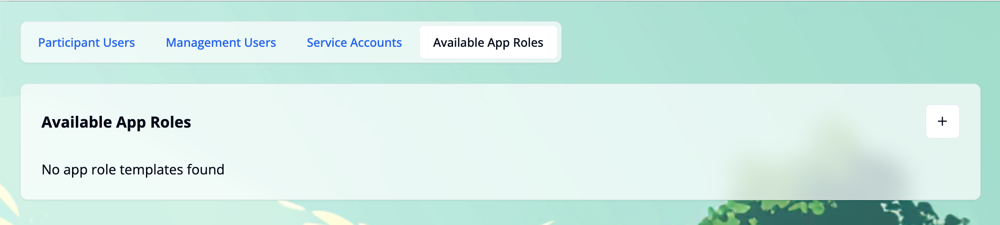
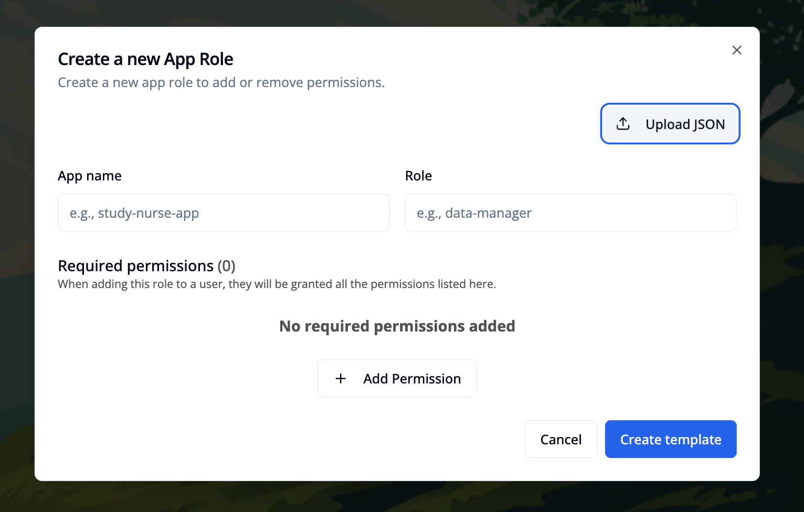

import { Step, Steps } from 'fumadocs-ui/components/steps';

## Overview

App role templates can be created, edited, and deleted in the **Available App Roles** tab of the **User Management** module. This functionality is available only for admin users.

## Add a new app role template
<Steps>

<Step>
Click the `+` button in the top right corner of the **"Available App Roles"** card. This will open a modal window.

</Step>

<Step>

Fill in the **"App name"** and **"Role"** fields. Add the required permissions by clicking the `+ Add Permission` button in the **"Required Permissions"** section.
You can remove a permission by clicking the `x` button on the right side of each list item.

</Step>

<Step>
Click the `Create template` button to save the app role template.

</Step>

</Steps>

## Copy and Paste an app role template

This can be particularly useful if you want to migrate an app role template from one environment to another.

<Steps>

<Step>
In the **"source environment"**: Click the `Copy` option in the three-dot menu on the right side of the app role template card.

</Step>

<Step>
In the **"target environment"**: Click the `+` button in the top right corner of the **"Available App Roles"** card. This will open a modal window with the option to paste value into the form.

</Step>
</Steps>

Alternatively, you can use the `Download JSON` option to save the app role template to a file and populate the form with the values from the file using the `Upload JSON` button.

## Edit an app role template

<Steps>

<Step>
Click `Edit` (pencil) in the three-dot menu on the right side of the app role template card to open a modal.

</Step>
<Step>
Make your changes. When you’re done, click `Save changes` to update the template.
</Step>
</Steps>

## Delete an app role template

You can delete app roles individually or all at once for an **"app name"**. Use the corresponding buttons and confirm the deletion in the popup.

When deleting app roles for an **"app name"**, this will also remove the added app roles from all management users that have this app role (not the permissions though).

> Note: Deleting templates does not revoke permissions previously granted via those roles. Review and clean up permissions as needed.