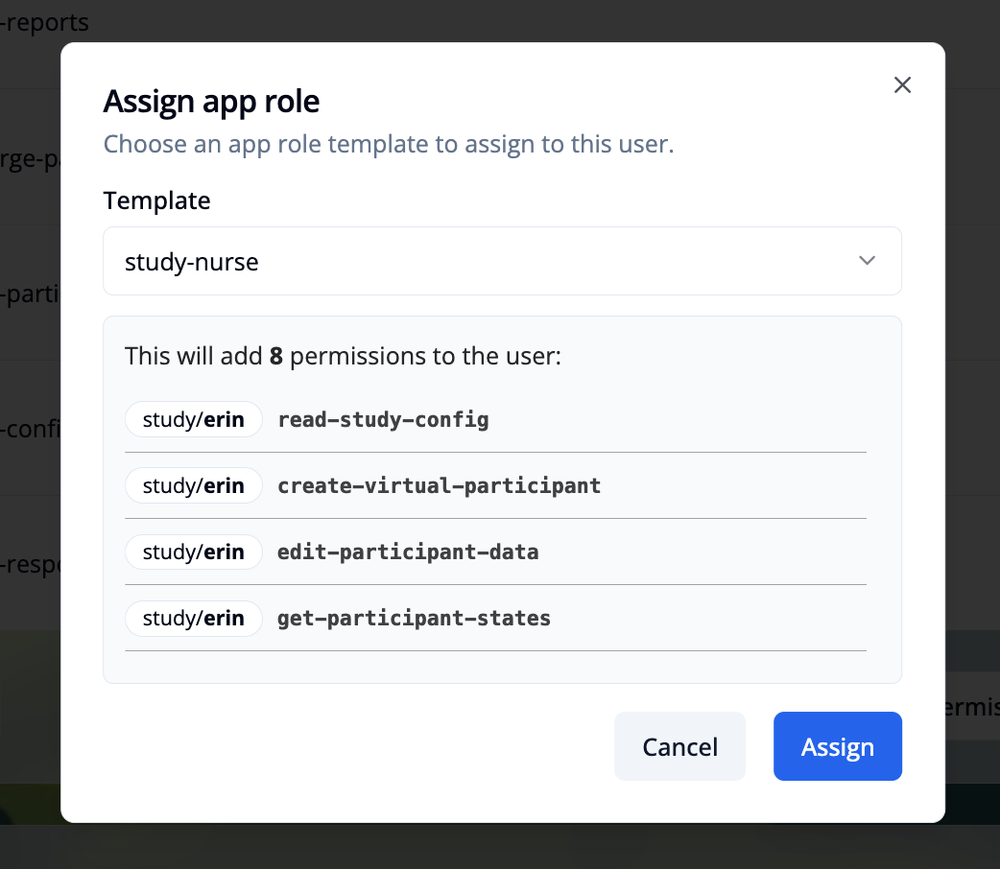

import { Step, Steps } from 'fumadocs-ui/components/steps';

This page describes how to assign app roles to management users.
The functionality is available only for admin users in the "User Management" module. After logging in, go to the **"User Management"** module and use the **"Management Users"** tab. Select the user you want to assign the app role to.

## Assign an app role to a management user

<Steps>

<Step>
Click the `+ Assign app role` button in the App Roles section. This will open a modal window.

</Step>

<Step>

Select an app role to assign. Only templates from the "App Role Templates" section that are not already assigned to the user are listed.

</Step>

<Step>
Click the `Assign` button to save the app role assignment to add the role and the permissions to the user.

</Step>

</Steps>

## Remove an app role from a management user
Click the trash icon next to the role to remove it from the user. Removing a role does not remove its permissions; you must remove permissions separately.

> Note: To avoid leaving residual privileges, review and remove any permissions that are no longer needed after removing an app role.
