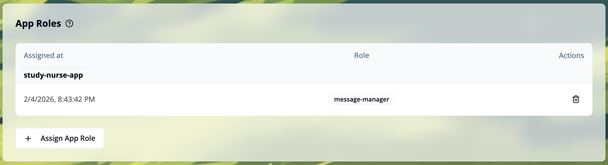
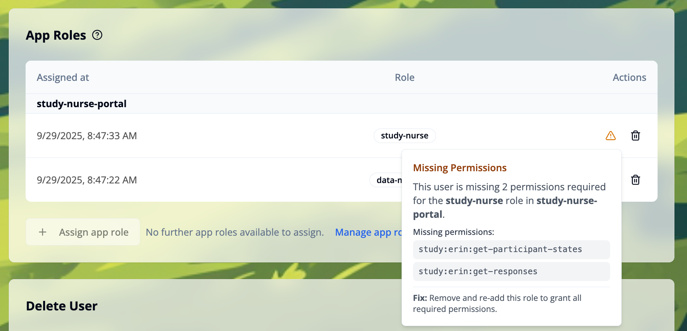

import { Step, Steps } from 'fumadocs-ui/components/steps';
import { Callout } from 'fumadocs-ui/components/callout';
import { ImageZoom } from 'fumadocs-ui/components/image-zoom';
import assignAppRoleDialogEmpty from './images/assign-app-role-dialog-empty.png';
import assignAppRoleDialogPopulated from './images/assign-app-role-dialog-populated.png';
import removeNonRolePermissions from './images/remove-non-role-permissions.png';

You can assign app roles to management users to grant them specific permissions. This functionality is only available for admin users. To get started, navigate to the **"Management Users"** tab and select the user you want to assign app roles to.

For more information about what app roles and app role templates are and how to create them, see the [App Roles](/docs/user-management/app-roles/basics) section.

## App Roles Overview

The **"App Roles"** list displays all app roles currently assigned to the user. Roles are grouped by app name (e.g., "study-nurse-app"), with each entry showing:

- **Assigned at**: The timestamp when the app role was assigned to the user
- **Role**: The role name from the app role template (e.g., "message-manager")
- **Actions**: Delete button (trash icon) to remove the app role from the user

If no app roles are assigned yet, the section will be empty until you assign the first role.

## Assign an App Role to a Management User

<Steps>

<Step>
Click the `+ Assign App Role` button in the App Roles section. This will open a modal window.

</Step>

<Step>

Select an app role to assign. Only templates from the **"Available App Roles"** section that are not already assigned to the user are listed.

<ImageZoom
className='p-2 bg-neutral-200 rounded-xl mx-auto'
src={assignAppRoleDialogEmpty}
width={400}
height={200}
alt="Assign app role dialog empty" 
/>

</Step>

<Step>
Click the `Assign` button to save the app role assignment and to add the role and the permissions to the user.

<ImageZoom
className='p-2 bg-neutral-200 rounded-xl mx-auto'
src={assignAppRoleDialogPopulated}
width={400}
height={200}
alt="Assign app role dialog populated" 
/>

</Step>

</Steps>

## Remove an App Role from a management user
Click the trash icon next to the role to remove it from the user. Removing a role does not remove its permissions; you must remove permissions separately.

<Callout type="warning">
To avoid leaving residual privileges, review and remove any permissions that are no longer needed after removing an app role.
</Callout>

## Throubleshooting

### Permissions that do not belong to a Role

The permissions list shows to which roles a permission is needed. This helps you determine if a permission is still needed after removing a role.

If the user has any permissions that do not belong to a role, you can remove them by clicking the `Remove Permissions without App Role` button on the bottom right side of the permissions list. This button will open a dialog to confirm the removal.

<ImageZoom
className='p-2 bg-neutral-200 rounded-xl mx-auto'
src={removeNonRolePermissions}
width={400}
height={200}
alt="Remove permissions without app role dialog" 
/>

After clicking the `Remove` button, the permissions will be removed from the user.

### Missing permissions for a role

In the **"App Roles"** section, a warning icon appears if the user is missing a required permission for a role. Click the icon to see the list of missing permissions.
A practical fix is to remove the app role and assign it again.

