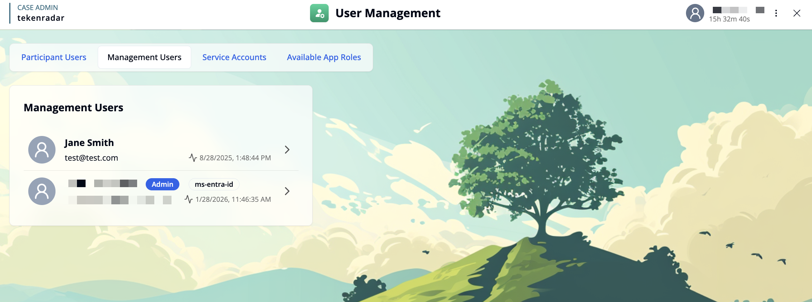
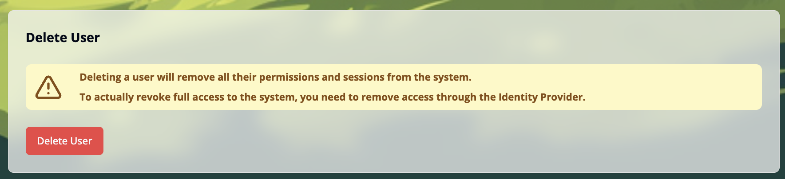

import { ImageZoom } from 'fumadocs-ui/components/image-zoom';
import { Callout } from 'fumadocs-ui/components/callout';
import userDetailsImg from './images/user-details.png';

## Overview

The **Management Users** tab displays all management user accounts in the system. Each user entry shows:

- **Profile icon**: A placeholder avatar for the user
- **Name**: The full name of the user
- **Email address**: The user's email address
- **Role**: The user's role in the main system (e.g., "Admin" displayed as a blue badge) and optional additional identifiers (e.g., "ms-entra-id")
- **Last login**: The last login time
- **Arrow button**: Click to view and manage user details

Click on a user card or the arrow button to access detailed settings for that user.

## User Details

When you select a user, you can view and manage their account information.

<ImageZoom
className='p-2 bg-neutral-200 rounded-xl'
src={userDetailsImg}
width={400}
height={200}
alt="User details" 
/>

### User Information

The User Details section displays:

- **Profile icon and name**: The user's avatar and full name
- **Email address**: The registered email address
- **Created at**: Timestamp when the user account was created
- **Last login at**: Timestamp of the user's most recent login
- **sub from IdP**: The subject identifier from the Identity Provider 
- **User ID**: The unique internal identifier for this user in the application

### Managing Permissions and App Roles

You can assign permissions and app roles to this user. For detailed instructions, see [Assigning Roles](/docs/user-management/management-users/assigning-roles).

## Delete User

If a management user account is no longer needed, you can permanently delete it from the system.

To access the delete option, scroll down to the bottom of the page.

<Callout type="warning">
Deleting a user will remove all their permissions and sessions from the system.

To actually revoke full access to the system, you need to remove access through the Identity Provider.
</Callout>

Click the red **"Delete User"** button to permanently remove the user account. This action cannot be undone.