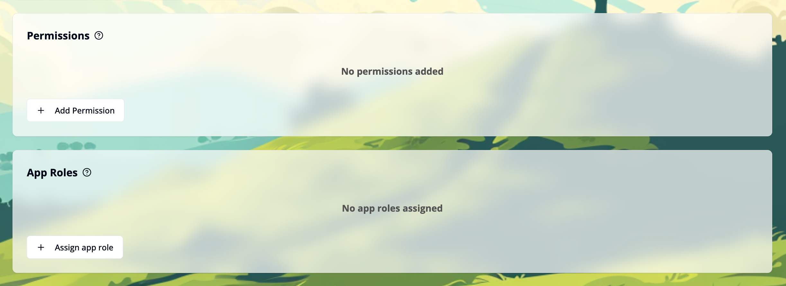
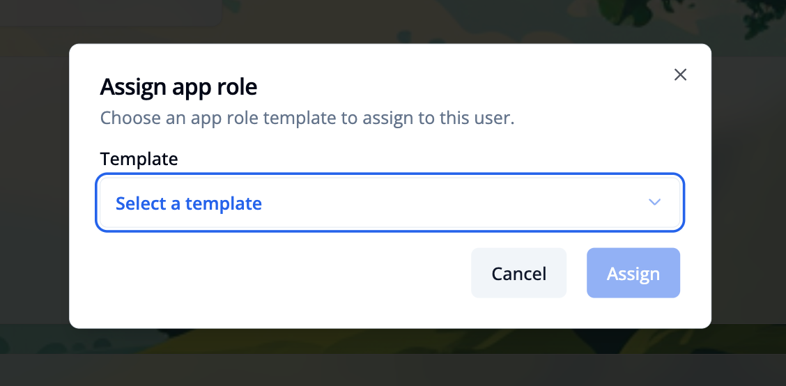
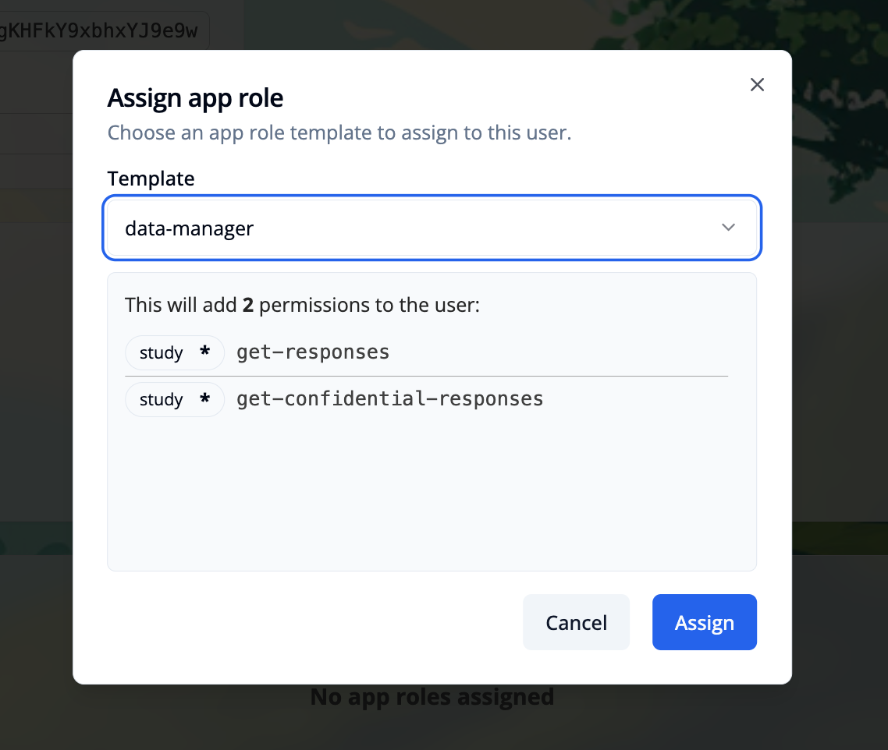
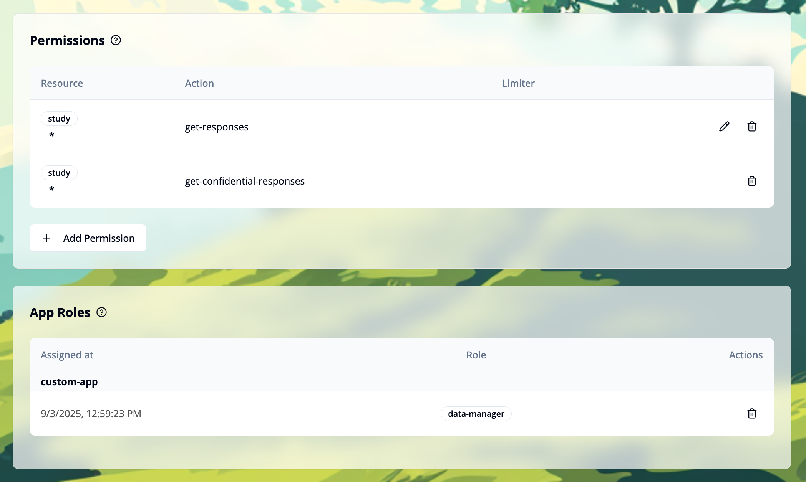

import { Step, Steps } from 'fumadocs-ui/components/steps';

This page describes how to use assign app roles to management users.
The functionality is available only for admin users in the "User Management" module. After logging in, go to the **"User Management"** module and use the **"Management Users"** tab. Select the user you want to assign the app role to.

## Assign an app role to a management user

<Steps>

<Step>
Click the `+ Assign app role` button in the App Roles section. This will open a modal window.

</Step>

<Step>

Select the app role you want to assign to the management user. Only roles that are available in the "App Roles Templates" section are shown, that are not already assigned to the user.

</Step>

<Step>
Click the `Assign` button to save the app role assignment to add the role and the permissions to the user.

</Step>

</Steps>

## Remove an app role from a management user

You can use the trash icon next to the role to remove it from the user. Removing the role does not remove the permissions from the user, you have to remove the permissions manually.
