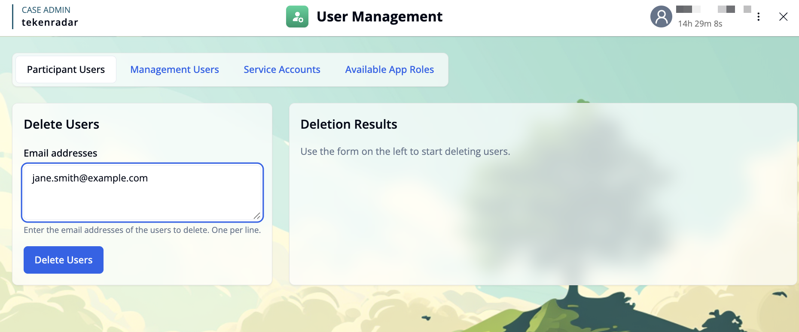
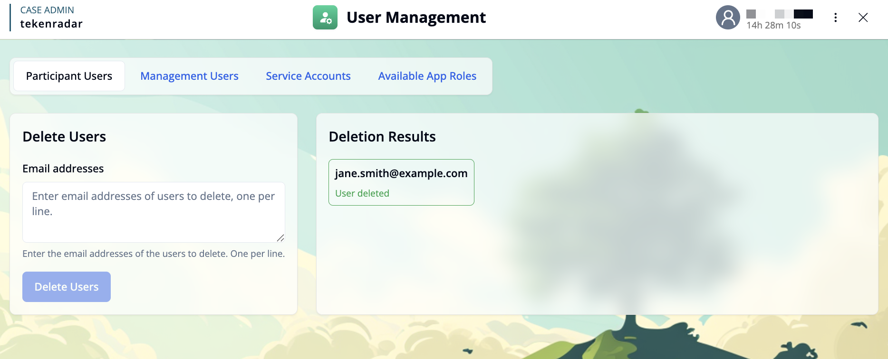

import { Callout } from 'fumadocs-ui/components/callout';
import { Step, Steps } from 'fumadocs-ui/components/steps';

## Overview

The **Participant Users** tab in the **User Management** module provides tools to manage participant accounts. This includes the ability to delete multiple participant users at once.

## Delete Users

The **Delete Users** feature allows you to remove multiple participant accounts from the system in a single operation.

### How to Delete Users

<Steps>
<Step>
**Enter email addresses**: In the text area labeled "Email addresses", enter the email addresses of the users you want to delete. Add one email address per line.
</Step>

<Step>
**Review your entries**: Make sure the email addresses are correct, as this action cannot be undone.
</Step>

<Step>
**Delete users**: Click the **"Delete Users"** button to start the deletion process.
</Step>

<Step>
**View results**: The deletion results will appear in the "Deletion Results" panel on the right side of the screen, showing which users were successfully deleted and if any errors occurred.
</Step>
</Steps>

<Callout type="warning">
This action permanently deletes the selected user accounts and all associated data. Make sure you have entered the correct email addresses before proceeding.
</Callout>
