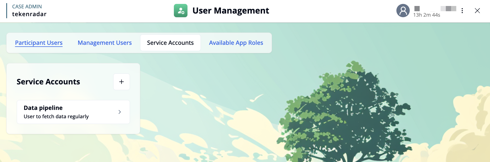
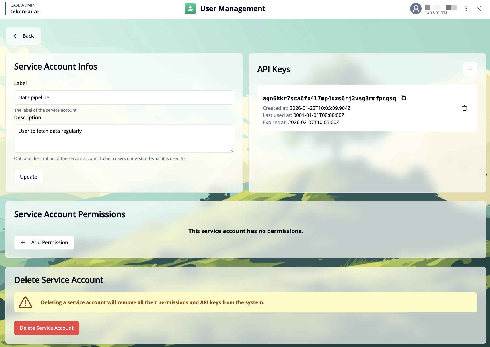
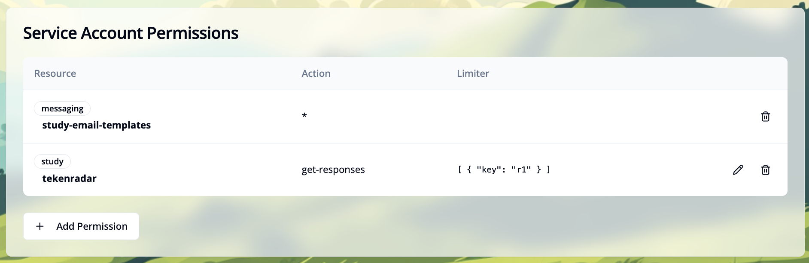
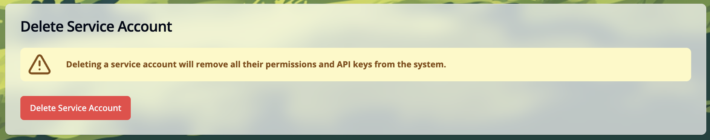

import { ImageZoom } from 'fumadocs-ui/components/image-zoom';
import { Callout } from 'fumadocs-ui/components/callout';
import { Step, Steps } from 'fumadocs-ui/components/steps';
import serviceAccountAddPermissionImg from './images/service-account3.png';
import serviceAccountAPIKeyImg from './images/service-account4.png';

## Overview

Service accounts are independent accounts that are not linked to a specific user. They are used to allow external services to access and interact with the system, enabling machine-to-machine communication. This is useful for automating tasks such as data downloads, API integrations, or scheduled operations.

## Use Cases

Service accounts are commonly used for:

- **Data pipelines**: Automated processes that fetch or push data regularly
- **API integrations**: Third-party services that need to interact with your system
- **Scheduled tasks**: Automated jobs that run on a schedule (e.g., backups, reports)
- **Monitoring services**: External tools that need read access to system metrics
- **CI/CD pipelines**: Automated deployment processes that need to interact with the system

## Service Accounts List

The **"Service Accounts"** tab displays all configured service accounts in the system. Each service account is shown with:
- **Label**: The name of the service account.
- **Description**: A brief description of what the service account is used for.

Click on a service account card to view and manage its details, or click the `+` button in the top right to create a new service account. When creating a new service account, you need to provide a label and can optionally add a description.

## Managing a Service Account

When you select a service account, you can manage its configuration, API keys, permissions, and deletion options.

### Service Account Information

This section allows you to configure the basic information for the service account:

- **Label**: The name of the service account. This is displayed in the service accounts list.
- **Description**: An optional description to help users understand what the service account is used for.

After making changes, click the `Update` button to save the modifications.

### API Keys

API keys are used to authenticate the service account when making requests to the system. Each service account can have multiple API keys.

The API keys section displays:
- **API Key**: The actual key string used for authentication (can be copied using the copy icon)
- **Created at**: The timestamp when the key was created
- **Last used at**: The timestamp when the key was last used (useful for monitoring active keys)
- **Expires at**: The expiration date of the key (if set)
- **Copy option**: Copy the API key to the clipboard (copy icon next to the key)
- **Delete option**: Remove the API key from the system (trash icon)

#### Creating a New API Key

Click the `+` button in the top right of the API Keys section to open the API key creation dialog.

<ImageZoom
className='p-2 bg-neutral-200 rounded-xl mx-auto'
src={serviceAccountAPIKeyImg}
width={400}
height={200}
alt="Add API key dialog" 
/>

In the dialog:
<Steps>
<Step>
**Set expiration date**: Toggle this option if you want the API key to expire automatically on a specific date
</Step>
<Step>
**Select expiration date**: If enabled, use the calendar to choose when the key should expire
</Step>
<Step>
**Generate New API Key**: Click the button to generate the new API key
</Step>
</Steps>

The new API key will be displayed and can be copied by clicking on the copy icon.

<Callout type="info">
Keep API keys secure and rotate them regularly. If a key is compromised, delete it immediately and generate a new one.
</Callout>

### Service Account Permissions

Permissions define which actions the service account is allowed to perform in the system. All granted permissions are displayed in a table below.

Each permission entry shows:

- **Resource**: The resource type and identifier (e.g., `study tekenradar`, `messaging study-email-templates`)
- **Action**: The action the service account can perform (e.g., `get-responses`). An asterisk (`*`) indicates all actions are allowed
- **Limiter**: Additional constraints in JSON format that restrict the permission to specific conditions (e.g., `[{"key": "r1"}]`). Click the pencil icon to edit the limiter
- **Delete button**: Click the trash icon to remove this permission

#### Adding Permissions

Click the `+ Add Permission` button to grant the service account access to specific actions or resources.

<ImageZoom
className='p-2 bg-neutral-200 rounded-xl mx-auto'
src={serviceAccountAddPermissionImg}
width={400}
height={200}
alt="Add permission dialog" 
/>

In the permission dialog, you can configure:

<Steps>
<Step>
**Resource Type**: Select the type of resource. Options are: `Study`, `Messaging`, or `Participant Users`.
</Step>

<Step>
**Resource Key**: Specify the resource identifier depending on the resource type:
   - For **Study**: Enter a study key (e.g., **"tekenradar"**) or use **"*"** for all studies
   - For **Messaging**: Select a resource ID from: `global-email-templates`, `study-email-templates`, `scheduled-emails`, or `sms-templates`
   - For **Participant Users**: Only `*` is available (applies to all participant users)
</Step>
<Step>
**Action**: Select the action the service account is allowed to perform (e.g., `get-reports`)
</Step>
<Step>
**Limiter** (available for specific actions): Define additional constraints in JSON format. For example, to limit access to specific reports, use the format `[{"reportKey": "report1"}]`
</Step>
</Steps>

After configuring the permission, click `Add Permission` to grant it to the service account.

#### Deleting Permissions

To remove a single permission, click the trash icon at the end of the permission row in the permissions table.

<Callout type="warning">
Review permissions regularly and remove any that are no longer needed to maintain security.
</Callout>

## Delete Service Account

If a service account is no longer needed, you can permanently delete it from the system. To access the delete option, scroll down to the bottom of the page.

<Callout type="warning">
Deleting a service account will remove all their permissions and API keys from the system. This action cannot be undone. Any external services using this service account will no longer be able to authenticate.
</Callout>

Click the red `Delete Service Account` button to permanently remove the service account. Make sure to update any external services that are using this account before deletion.
