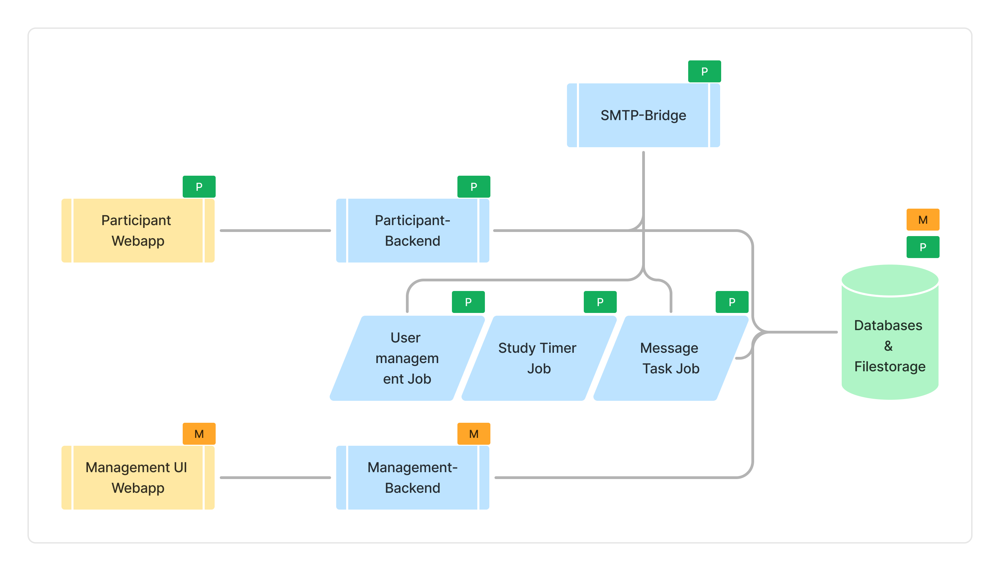

This page wants to give you an overview of the standard set of components offered by the CASE Framework.
Detailed documentation for each component is available in their respective pages.

# What is the CASE Framework?

CASE is an event-driven, context-aware study system for participatory research. It consists of multiple repositories and services that form a unified software system.

## Inlcuded Features

CASE provides:

- Administrative UI including features like a Survey Editor, Study Configurator, Participant Management, Data Explorer, ...
- Rendering & logic for questionnaires (embedded within an existing frontend) through the Study Engine
- Definition of automated actions within studies
- Creating, editing & simulation of questionnaires
- Necessary preconfigured database models & database interactions
- Data exporting
- Access restriction (who can access / edit what)
- Messaging features (template-based email, sent through SMTP Client or SMS service)
- User management for participants
- Logging of activities

## Not Included Features

CASE does not provide:

- Participant-facing UI for your study
- Data Analysis
- Database

## Offered components

### Backend Services

Event-driven APIs to interact with the system.

#### Management API

Bundles the functionality needed to manage the system and its resources. Provides authentication and authorization for the admin UI and other tools.
[More information](/tech-docs/management-api/overview)

#### Participant API

A collection of APIs for implementing participant-facing functionality. Includes built-in multi-factor authentication and user management and study interactions.
[More information](/tech-docs/participant-api/overview)

#### SMTP Bridge

Internal service to bridge the framework's email sending to an external SMTP server. Has a simple API to send emails. In case, the setup is using a different email provider, this service can be replaced with a custom implementation.
[More information](/tech-docs/smtp-bridge/overview)

#### SMTP Bridge Emulator

Identical API to the SMTP Bridge, but instead of sending emails through an SMTP connection, it will write them to disk at a specified location. Useful for testing or development purposes, when no SMTP server is available yet, or to avoid sending related costs/risks in load testing.

---

### Backend Jobs

Scheduled or one-off jobs to be run on the server.

#### Study Timer

This job handles scheduled timer operations for active studies, including updating study statistics, executing timer-based actions, and optionally cleaning up orphaned task results.

#### User Management

This job handles scheduled user management operations including account cleanup, verification reminders, inactivity management, and profile ID lookup generation. It helps maintain data integrity and manages the user lifecycle across studies.

#### Messaging

This job handles various messaging-related tasks including processing outgoing emails, scheduled messages, study messages, and researcher notifications.

#### Study Daily Data Export

This job handles daily data exports for studies, including survey responses and confidential response exports. It also provides cleanup functionality for orphaned task results.

#### DB migration

This job handles various db migration tasks including dropping and creating indexes.

---

### Applications

#### Admin UI

CASE's Admin UI is a web app for setting up and running research studies. It lets you design surveys, manage participants, and send study messages - all in one place.

#### Recruitment List Application

A go backend and Next.js frontend application that can be used to pull participant data and share it with external partners.

---

### Libraries

#### Survey Engine

A Typescript library for handling surveys. It's used for handling dynamic conditions to determine which questions should be shown to the participant, and to map the survey's definition and current state to a renderable survey.

The Admin UI contains a reference implementation of components using the survey engine, to showcase how it can be used with React, and Tailwind CSS to build a survey user interface.

#### Editor tools

A Typescript library with helper functions, types and utilities for coding study rules, actions or surveys.

---

## Basic application architecture

The framework can be utilized in a variety of ways depending on the use case.
The standard application setup is as follows:

1. External resources:
   - MongoDB database
   - Email server with SMTP
   - Persistent storage for files
2. Framework components:
   - Participant-facing:
     - participant-api: backend component to handle participant events and data
     - participant-frontend: frontend component to handle participant interactions. In most cases, this was implemented as a Next.js application so far, but it's not a requirement.
   - Management-facing:
     - management-api: backend component to handle management events and data
     - case-admin (Admin/Management UI): a web application to handle management interactions, to configure the application and its studies, or access data in the system.
   - smtp-bridge: to bridge the framework's email sending to an external SMTP server
   - Jobs run on regular intervals:
     - messaging: to handle messaging-related tasks, such as processing message queues or generating scheduled messages
     - study-timer: to update study statistics and handle study timer events
     - user-management: to handle user management tasks, such as reminding users to verify their email address, or cleaning up unused or unverified user accounts
3. Optional components:
   - study-daily-data-export: to prepare daily data exports for researchers
   - recruitment-list application (with backend and frontend): pull participants and their data for recruitment purposes and share it with external partners
